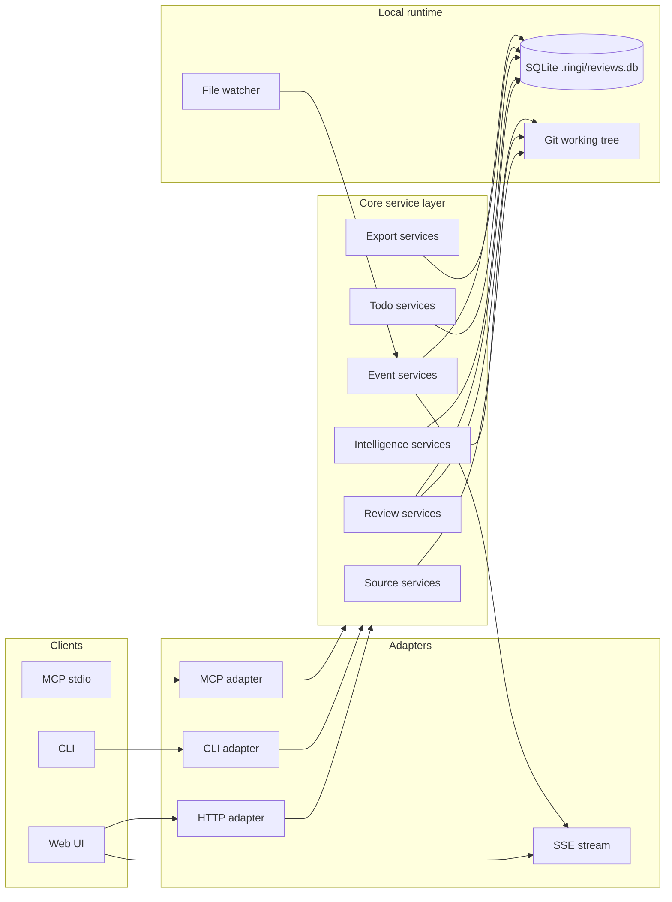
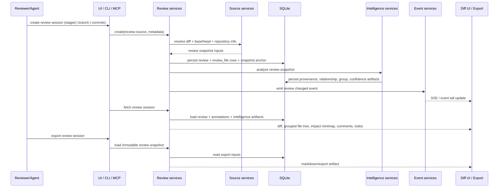
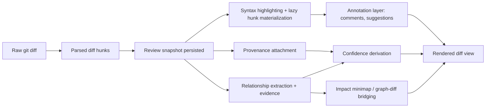
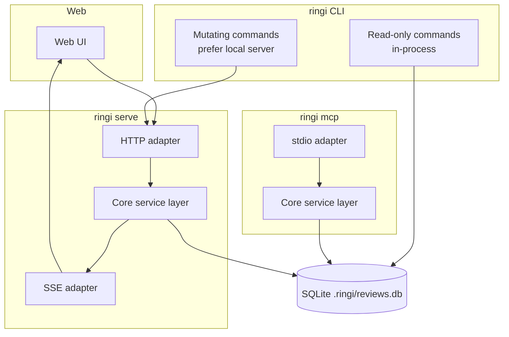

# Ringi Architecture

Status: Living document | Last updated: 2026-03-21

## 1. Vision

Ringi is becoming a local-first human review workbench for AI-generated code: a system where a reviewer can create a review session from a real git diff, inspect the diff with machine-generated provenance and evidence, understand first-order impact without leaving the review, and drive the same review state from Web UI, CLI, or MCP stdio through one shared core service layer.

## 2. Product Thesis

Ringi stands on three pillars.

1. **First-class review workflows** keep the product anchored in the review session as the unit of value: comments, suggestions, status, export, grouped navigation, and premium diff UX are not accessories; they are the product core.
2. **First-class CLI and local automation** make the local-first claim real: `ringi serve`, `ringi review`, `ringi list`, `ringi status`, and `ringi export` must be stable entrypoints rather than thin wrappers around a browser workflow.
3. **Review-scoped intelligence** adds structure only where it improves a review decision: provenance, evidence, grouped file tree, impact minimap, graph-diff bridging, and confidence score all exist to reduce uncertainty inside one review snapshot.

The thesis has direct architectural consequences. Ringi is not a code exploration tool, not a hosted collaboration platform, and not a global knowledge graph. The architecture optimizes for bounded review snapshots, inspectable evidence, local execution, and one shared business layer consumed by every surface.

## 3. Design Principles

1. **Review-scoped, not exploration-scoped.** Analysis is bounded to the current review session and its immediate blast radius so the system stays fast, explainable, and product-aligned.
2. **Provenance first, narrative second.** Machine-generated structured JSON is the primary input because agents can emit it deterministically and reviewers can inspect it later.
3. **Evidence or it does not count.** Every relationship or confidence score must carry inspectable proof, otherwise the UI is manufacturing trust.
4. **workflow before deep analysis.** CLI coverage, source selection, watcher wiring, and export loops ship before compiler-grade intelligence because workflow gaps break the product sooner than analysis gaps.
5. **Local-first by default.** Read-heavy workflows must function without a network or mandatory server process because the SQLite review store is the system anchor.
6. **Agent-native from day one.** Agents need a stable way to create review sessions, inspect state, and react to reviewer feedback through the same domain model humans use.
7. **Mechanical work should be batchable.** The architecture should help reviewers spend attention on uncertain files while low-risk mechanical work becomes explicit bulk workflow.
8. **Replace heuristics with parsers only when the contract survives the upgrade.** Regex extraction is allowed early, but only behind stable contracts that tree-sitter can later satisfy without forcing product-layer rewrites.

## 4. Architectural Scope

This document covers the runtime and data architecture of Ringi across four delivery surfaces: Web UI, HTTP server, CLI, and MCP stdio. It defines the shared core service layer, operational modes, bounded contexts, eventing model, persistence strategy, review lifecycle, intelligence boundaries, security posture, extensibility points, and phase-by-phase evolution path. It is intentionally opinionated about boundary placement and transport responsibilities; it is intentionally not a command reference, endpoint reference, or MCP schema reference.

## 5. Explicit Non-Goals

| Non-goal | Why Ringi does not build it |
| --- | --- |
| Generic codebase exploration product | Exploration-first UX optimizes for a different job and would pull the product away from review sessions. |
| Full persistent knowledge graph of the repository | The cost, invalidation surface, and UI complexity are wrong for review-scoped intelligence. |
| Human-authored narrative documents as required intelligence input | Provenance must be structured and machine-emittable; human summaries are optional decoration. |
| Multi-user hosted collaboration platform | Ringi is a premium local-first workbench, not a cloud review system. |
| Compiler-grade cross-language static analysis in v1 | Workflow completeness, provenance, grouping, and evidence produce more product value sooner. |
| Auto-applying code changes from suggestions or graph insights | The safety surface expands faster than review discipline if the system starts mutating code automatically. |
| Replacing GitHub or GitLab PR review | Ringi is a local pre-push review layer and export source, not a remote review host. |
| Full-text or semantic code search product | Search may appear as implementation detail later, but it is not a first-class product surface. |

## 6. System Overview

The adapter rule is strict: Web UI, CLI, and MCP do not own business rules. Adapters translate transport concerns into core service calls, and only the core service layer touches review semantics, persistence rules, provenance handling, status transitions, and intelligence generation.

## 7. Operational Modes

| Mode | Entry surface | What works | What is intentionally unavailable |
| --- | --- | --- | --- |
| **Standalone** | Direct CLI read-only commands | `ringi list`, `ringi status`, `ringi export`, local diagnostics, direct SQLite reads, snapshot inspection | Live SSE, browser UI, mutation endpoints requiring serialized server orchestration |
| **Server-connected** | `ringi serve` + Web UI and HTTP clients | Full review creation, comment/suggestion workflows, todo mutation, export, SSE updates, watcher-driven refresh, shared HTTP contracts | None of the local-first guarantees are removed; the server is a convenience and mutation coordinator, not a cloud dependency |
| **MCP stdio** | `ringi mcp` | Agent integration through namespaces such as `reviews`, `intelligence`, `todos`, `exports`, and `events`, read-heavy review inspection first, controlled mutations later | Embedded MCP inside the web server, network dependency, unbounded repo exploration |

The same review session model must behave coherently across all three modes. The only thing that changes is transport and availability of live coordination features.

## 8. Core Runtime Model

Ringi runs on **TanStack Start** for route-driven application composition and **Effect** for service construction, dependency injection, resource lifetime, and runtime boundaries. The current codebase already reflects this shape: route handlers live under `src/routes`, the server route composes Effect layers, SQLite is initialized through an Effect service, and UI clients use an Effect-managed runtime to consume typed APIs.

Boot flow is split by surface:

1. **Server boot (`ringi serve`)** starts the TanStack Start app, constructs the Effect layer graph, initializes SQLite in WAL mode, wires repositories and services, mounts HTTP/RPC routes, and starts the file watcher so structured events can flow to SSE subscribers.
2. **CLI boot** constructs a slimmer runtime. Read-only commands open SQLite and source services in-process. Mutating commands should route through the local server when it is available so the system preserves a single serialized write path.
3. **MCP boot (`ringi mcp`)** starts a dedicated stdio process, builds the same core services, and exposes namespaced review/intelligence capabilities without depending on the web server process.

The architectural decision is explicit: one core service layer, multiple runtimes. The current implementation keeps services under `src/routes/api/-lib/services`, repositories under `src/routes/api/-lib/repos`, SQLite under `src/routes/api/-lib/db`, and transport wiring under `src/routes/api/-lib/wiring`. That file placement can evolve, but the runtime shape should not.

## 9. Domain Boundaries

| Bounded context | Owns | Does not own |
| --- | --- | --- |
| **Review** | `review`, `review_file`, `comment`, `suggestion`, status transitions, snapshot anchoring, diff-level metadata | Global code graph, parser internals, shell command UX |
| **Intelligence** | `provenance`, `relationship`, `group`, `confidence`, impact minimap data, graph-diff bridging artifacts | Review creation transport, standalone code exploration, opaque ML scoring |
| **Export** | `export` artifacts, markdown rendering, snapshot-based audit output, stable serialization of review state | Review mutation rules, intelligence extraction, live event transport |
| **Todo** | `todo` lifecycle, review-linked task tracking, shell/UI parity for operational follow-up | Review comment semantics, export formatting, graph analysis |
| **Event** | SSE event broadcasting, watcher integration, invalidation hints, event payload contracts | Business decisions about review state, persistence schema beyond event cursors if added later |
| **Source** | `review source` resolution, git diff acquisition, base/head normalization, repository metadata | Review status lifecycle, UI presentation, confidence scoring |

These boundaries are designed to keep the next phase honest. Intelligence should depend on Review and Source snapshots; Review should not depend on Intelligence internals to remain operable.

## 10. Component Architecture

| Logical component | Responsibilities | Primary consumers |
| --- | --- | --- |
| **Presentation layer** | Diff UI, grouped file tree, impact minimap, comment threads, todo panel, review source forms | Web UI |
| **Transport adapters** | HTTP route handlers, RPC handlers, CLI command handlers, MCP stdio namespace adapters, SSE stream bridge | Web UI, CLI, MCP |
| **Core review services** | Create/read/update review session, load hunks, attach comments/suggestions, manage lifecycle state | All adapters |
| **Core intelligence services** | Build review-scoped subgraph, compute grouped file tree, attach evidence, derive confidence score, bridge graph selection back to diff | Web UI, CLI, MCP |
| **Core source services** | Resolve staged/branch/commits diffs, base/head refs, repository metadata, snapshot capture | Review services, intelligence services |
| **Core export services** | Serialize review session into markdown and later machine-readable exports tied to a review snapshot | Web UI, CLI, MCP |
| **Core event services** | Watch filesystem, debounce changes, publish structured events, support CLI event tailing and UI invalidation | Web UI, CLI |
| **Persistence layer** | SQLite repositories, migrations, query helpers, WAL-safe write boundaries | Core services |
| **Parsing layer** | Regex extraction first, tree-sitter later, both behind a stable intelligence contract | Intelligence services |

Suggested package direction is logical, not mandatory file layout: `presentation`, `adapters`, `core/review`, `core/intelligence`, `core/source`, `core/todo`, `core/export`, `core/event`, `persistence`, `parsers`.

## 11. Data Flow

The critical invariants are: review creation starts from a `review source`, persistence happens before analysis results are exposed, all intelligence is tied to the immutable review snapshot, and exports are reproducible from stored snapshot inputs plus persisted annotations.

## 12. Storage and Persistence Strategy

SQLite in `.ringi/reviews.db` remains the source of truth. The database runs in **WAL mode** with foreign keys enabled so the system can support concurrent reads, a single serialized writer, and crash-safe local persistence. This matches the product constraint that read-only CLI operations must not require a running server.

Schema direction:

- **`reviews`** remains the review session anchor and stores source metadata, repository metadata, snapshot metadata, status, and timestamps.
- **`review_files`** grows to include structured `provenance`, derived `confidence`, and a stable grouping key or group reference. It already anchors per-file diff metadata; it becomes the first place reviewers inspect why a file changed.
- **`review_relationships`** is introduced for review-scoped edges: source file, target file, relation kind, evidence payload, confidence inputs, and `snapshot_id` / review anchor.
- **`review_groups`** is introduced when grouped file tree ordering must persist rather than be recomputed deterministically from the review snapshot.
- **Exports** remain reproducible from the snapshot anchor and persisted review annotations; derived data must be reproducible from raw snapshot inputs.

Migration strategy is additive and conservative:

1. Add nullable columns for provenance and confidence before making them required in product flows.
2. Add new tables (`review_relationships`, `review_groups`) instead of packing queryable structures into one opaque JSON blob.
3. Keep version fields on structured JSON payloads so older reviews remain readable.
4. Never require a full graph rebuild across the entire repository; migrations operate on persisted review snapshots only.

## 13. Eventing and Realtime Strategy

Realtime is server-mediated. A file watcher observes the working tree, emits structured change events into the event service, and the server streams those events over SSE to browser clients. The current code already contains the essential pieces: a chokidar-backed watcher, a typed event stream, and an `/api/events` SSE route. The missing architectural requirement is complete boot wiring and consistent event consumption across all surfaces.

Required event types:

- `reviews` — review created, status changed, review refreshed
- `comments` — comment or suggestion created/updated/resolved
- `todos` — todo created/reordered/resolved
- `files` — working tree file change affecting a live review session
- `intelligence` — analysis completed or invalidated for a review snapshot

Operational rules:

- Watcher payloads are structured and scoped to changed files or review ids, not generic “refresh everything” signals.
- File system bursts are debounced before broadcast; the existing 300ms debounce is the right shape for Phase 1.
- UI consumers refresh affected review slices, not the entire application state.
- CLI `events` mode should tail the same SSE stream rather than invent a second event protocol.

## 14. Review Model

A review session is the unit of value. It is an immutable snapshot of a diff plus mutable review annotations and derived intelligence artifacts.

Target lifecycle:

| State | Meaning | Entered when | Exits to |
| --- | --- | --- | --- |
| `created` | Review row exists, snapshot inputs captured, analysis not yet started | Review session persisted | `analyzing` |
| `analyzing` | Diff parsed, provenance/group/relationship/confidence generation running | Analysis job accepted | `ready` or `changes_requested` on fatal creation issue |
| `ready` | Review snapshot and primary intelligence are available | Initial analysis completes | `in_review` |
| `in_review` | Human or agent is actively annotating and resolving the review | First comment, suggestion, todo, or explicit start action | `approved` or `changes_requested` |
| `approved` | Reviewer accepts the change for export or downstream action | Reviewer confirms approval | `exported` |
| `changes_requested` | Reviewer rejects current revision and expects iteration | Reviewer requests changes | `exported` or back to `analyzing` on refreshed snapshot |
| `exported` | Audit artifact emitted from the current snapshot | Export recorded | Terminal for that snapshot |

Explicit architectural decision: the current single `status` column is too coarse for this lifecycle. The long-term model should separate **workflow state** from **review decision** and store `exported_at` independently, even if Phase 1 continues with additive status values for compatibility.

## 15. Review Source Model

A `review source` determines how the system captures a diff and anchors a review snapshot.

| Review source | Input shape | Base/head resolution | Resulting diff anchor |
| --- | --- | --- | --- |
| `staged` | Current staged index against `HEAD` | `base = HEAD`, `head = staged index` | Snapshot of staged changes at creation time |
| `branch` | Named branch or ref compared against current branch/HEAD target | `base = branch ref`, `head = working branch/HEAD` | Snapshot of divergence from a branch boundary |
| `commits` | Explicit commit range or ordered commit list | `base = oldest selected commit parent or explicit range base`, `head = newest selected commit` | Snapshot of a bounded historical diff |

Rules:

- `staged` is the fastest local workflow and may store hunks directly for deterministic replay.
- `branch` and `commits` can regenerate hunks from git when needed, but the review snapshot must still capture enough metadata to reproduce exports and analysis.
- Base/head resolution must be explicit in persisted metadata; hidden git defaults are unacceptable because they make exports and agent verification non-reproducible.

## 16. Diff Processing Pipeline

Pipeline responsibilities are deliberately split. The diff parser turns raw git output into `review_file` records and hunks. Rendering turns hunks into syntax-highlighted UI segments with lazy loading. Annotation layers attach comments and suggestions. Intelligence layers add provenance, relationship evidence, grouped file tree membership, and confidence score. Rendering never invents intelligence; it only displays persisted or recomputable artifacts tied to the review snapshot.

## 17. Code Intelligence Boundaries

Review-scoped intelligence does four jobs:

1. **Structure the review** with a grouped file tree based on directory and import heuristics.
2. **Expose first-order impact** through review-scoped relationships and the impact minimap.
3. **Explain why the change exists** using provenance attached to each changed file or group.
4. **Prioritize attention** using an inspectable confidence score derived from provenance quality, evidence quality, and mechanical-change signals.

It explicitly does not do the following:

- No full-repository persistent graph.
- No exploration UI detached from the diff.
- No “trust me” score without evidence.
- No broad code search or codebase map product.
- No analysis outside the current review snapshot and immediate dependents.

This boundary is the core product defense. It keeps intelligence useful to the reviewer instead of turning into a second, competing product.

## 18. Agent Integration Strategy

Agents integrate through **MCP stdio** started by `ringi mcp`, not through an embedded web-server MCP mode. The MCP surface should expose a small set of powerful namespaces—at minimum `reviews`, `intelligence`, `todos`, `exports`, and `events`—and prefer a codemode-style `execute` interaction model over dozens of brittle one-off tools. Inside that sandbox, the agent gets a namespaced local API backed by the same core services the UI and CLI use.

Adoption sequence matters:

1. **Read-heavy first.** Agents list review sessions, inspect grouped files, read diff hunks, read provenance/evidence/confidence, and fetch todos/comments.
2. **Structured creation next.** Agents create a review session with provenance and optional group hints once review creation contracts are stable.
3. **Deterministic self-verification later.** Agents call intelligence-backed validations to check propagation coverage and unresolved risk before asking for approval.
4. **Mutations last.** Comment creation, todo mutation, and resolution should arrive only after read and creation contracts prove stable.

The system requirement is strict: agents must interact with the same review state humans inspect, not an alternate shadow representation.

## 19. CLI / Server / Web UI / MCP Relationship

Transport rules:

- **Web UI → server:** over HTTP and SSE.
- **CLI read-only → core/storage:** in-process, no server required.
- **CLI mutations → server:** route through the local server when it is running so write coordination stays centralized.
- **MCP → core:** over stdio into a dedicated process that reuses the same services, not via browser HTTP APIs.

The same domain objects—`review`, `review_file`, `comment`, `suggestion`, `todo`, `provenance`, `relationship`, `group`, `confidence`, `export`—must remain canonical everywhere.

## 20. Security and Local-First Guarantees

Ringi is designed to run with no network dependency. Review data lives in `.ringi/reviews.db`, exports are generated locally, and MCP stdio communicates over local process boundaries rather than remote APIs. The default posture is: data never leaves the machine unless the user explicitly exports it or exposes the local server.

Security guarantees and requirements:

- `ringi serve` may optionally support HTTPS and basic auth for local network use, but those are opt-in hardening features, not required for normal operation.
- SQLite file permissions should follow user-only access defaults where the OS allows it; the review store is sensitive because it contains diffs, comments, and provenance.
- MCP sandbox execution must run in a constrained JS environment with explicit namespace allowlists and no arbitrary filesystem or process escape.
- CLI read-only commands must avoid mutating repository state or the database when invoked for inspection.
- Evidence and provenance rendering must treat content as untrusted text; no HTML execution path is allowed.

Local-first is not just deployment shape; it is an integrity promise about data location, runtime independence, and failure isolation.

## 21. Extensibility Model

Ringi must be extensible without invalidating higher-layer contracts.

Primary extension seams:

- **Parser layering:** regex extraction ships first, tree-sitter replaces or augments it later behind a stable contract that yields `relationship`, `group`, evidence, and confidence inputs.
- **Language support:** language-specific extractors plug into the parsing layer, but the review/intelligence services consume normalized outputs.
- **MCP namespace expansion:** begin with `reviews` and `intelligence`, then add more write-capable namespaces only when the review model stabilizes.
- **Export formats:** markdown is first, but export services should be able to add machine-readable formats without re-querying business logic in adapters.

There is deliberately no plugin marketplace or arbitrary remote extension system in the architecture. Extensibility exists to deepen the review workbench, not to turn the product into a general platform.

## 22. Observability and Diagnostics

Ringi needs diagnostics proportional to a local reliability tool, not a demo app.

Required observability surfaces:

- **`ringi doctor`** validates SQLite availability, WAL mode, repository detection, watcher health, and adapter bootstrap.
- **Structured logging** records review creation, analysis start/finish, export generation, watcher lifecycle, SSE subscribers, and MCP adapter startup.
- **SSE debugging** exposes event counts, connected client count, and last event timestamps so stale refresh bugs can be explained.
- **Review analysis timing** records per-review and per-file extraction durations, timeout counts, and fallback path usage.
- **MCP diagnostics** report namespace availability, sandbox failures, and rejected operations without leaking internal stack noise into agent contracts.

The main rule is simple: when the system refuses a review mutation or produces no intelligence, the operator must be able to learn why from local diagnostics instead of guessing.

## 23. Performance Constraints

Ringi should feel immediate on the review sizes it claims to support, which means architectural budgets matter more than micro-optimizations.

Key constraints:

- Analysis is scoped to the current review snapshot and first-order dependents only.
- No full-repository indexing or background graph maintenance is allowed.
- SQLite queries must stay narrow and snapshot-bound; queryable intelligence artifacts belong in dedicated tables, not giant blobs.
- Diff rendering should keep lazy hunk loading so large reviews do not eagerly materialize every hunk.
- Watcher invalidation must refresh only impacted review slices.
- Confidence derivation must be deterministic and linear in changed files plus first-order relationships, not in repository size.

This is how Ringi stays premium on a laptop instead of becoming a local resource hog pretending to be intelligent.

## 24. Failure Modes

| Failure | What happens | Recovery strategy |
| --- | --- | --- |
| Corrupt SQLite database | Review reads or writes fail; the workbench cannot trust persisted state | `ringi doctor` detects corruption, server and CLI refuse unsafe mutations, restore from backup or rebuild from exported artifacts where possible |
| Stale or dead file watcher | UI stops reflecting local diff changes; agents and reviewers see outdated state | Detect via heartbeat / last event timestamp, allow manual refresh, restart watcher without restarting the entire app |
| Diff extraction timeout | Provenance, relationships, or confidence stay incomplete for the review snapshot | Mark intelligence as partial, surface timeout in diagnostics, allow retry, keep raw diff review usable |
| MCP sandbox escape attempt | Untrusted code tries to access disallowed capabilities | Deny execution, log a security event, preserve process isolation, keep core services unavailable to the escaped context |
| Server unavailable during CLI mutation | Mutating CLI commands cannot serialize writes through the preferred path | Fail fast with a clear message or explicitly start/target a local server; read-only commands remain available |
| Review source mismatch | Requested `staged`, `branch`, or `commits` diff resolves to no changes or invalid refs | Reject review creation with a source-specific error and no partial review session |
| Evidence generation mismatch | Relationship exists heuristically but evidence cannot be shown | Downgrade confidence, mark the edge as unsupported, do not present it as authoritative |
| Export generation failure | Review cannot be turned into an audit artifact | Leave review session intact, record diagnostic details, allow retry from the same snapshot |

## 25. Migration / Evolution Path

The roadmap phases are architectural phases, not just backlog buckets.

| Phase | Architectural change | Compatibility rule |
| --- | --- | --- |
| **Phase 1: Operational Surface** | Finish watcher boot wiring, expose full review source selection, introduce real CLI runtime, add provenance storage, add directory grouping, add regex extraction, ship MCP foundation | All changes are additive; existing review creation and diff rendering continue to work |
| **Phase 1.5: Trust Layer** | Persist/display relationship evidence, impact minimap, provenance headers, confidence score, graph-diff bridging | Intelligence remains review-scoped and optional; reviewers can still operate on raw diff alone |
| **Phase 2: Deep Intelligence** | Introduce tree-sitter behind the stable parsing contract, add export/symbol extraction, caller/callee impact, rename detection, improved grouping, expanded intelligence namespaces | Regex stays as fallback until the higher-fidelity parser proves contract parity |
| **Phase 3: Agent Review Loop** | Add structured agent review creation, deterministic self-verification, selective batch approval, review diff subscriptions | Agent features layer onto the same review session model; they do not fork the domain |

The architecture accommodates this path because it already separates transport from business logic, keeps intelligence tied to review snapshots, and treats parsing as a replaceable backend rather than a product contract. That is the difference between a roadmap that survives implementation and one that collapses under its own shortcuts.
