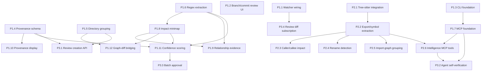

# Ringi Code Intelligence Roadmap

Status: Draft for execution

Owners/Scope: Product + platform + review intelligence. Scope covers local app, CLI, API/MCP, review-scoped intelligence, and rollout sequencing.

## Executive Summary

Ringi should become the premium local-first human review workbench for AI-generated code.

That requires three pillars to mature together:

| Pillar | Why it exists | What changes now |
| --- | --- | --- |
| Review workflows | Human review quality is the product core | Keep investing in comments, suggestions, status, export, and premium diff UX |
| CLI and local automation | Local-first products live or die on automation surfaces | Add a serious CLI, not a hidden dev server |
| Review-scoped code intelligence | Reviewing large agent diffs needs structure, impact, and confidence | Build change-scoped intelligence, not a generic code explorer |

This roadmap does not turn Ringi into code_diver. It absorbs the operational surface GitHuman already proved valuable, then extends beyond both competitors with review-scoped intelligence, provenance-first metadata, and an agent-native API.

## Product Thesis

Ringi is evolving into a local-first human review workbench for AI-generated code, combining three pillars:

1. First-class review workflows: inline comments, suggestions, status, export.
2. First-class CLI and local automation entrypoints.
3. Review-scoped code intelligence that improves confidence without becoming a generic code exploration tool.

Thesis implications:

- The unit of value is a review session, not a codebase map.
- Intelligence must reduce reviewer uncertainty inside a specific diff.
- Automation must work locally, without forcing the web UI to be the only entrypoint.
- Agents must be first-class actors: structured metadata in, review state out.

## Problem Statement

A human reviewing a 40-file AI-generated change across 8 modules is asked to make a correctness decision with almost no structure.

Today the reviewer gets:

- A file list ordered by path, not by concern.
- Raw diffs, but little help understanding propagation or blast radius.
- No machine-readable provenance for why each file changed.
- No confidence signal separating mechanical updates from heuristic changes.
- No automation surface for agents to create, inspect, and verify reviews.

Failure modes this creates:

| Failure mode | What happens | Why it matters now |
| --- | --- | --- |
| Missed propagation | Source file changed, some callers not updated | Common AI failure mode; expensive to detect manually |
| Shallow review | Reviewer skims because the change is unstructured | AI diffs are getting wider, not smaller |
| False confidence | Heuristic relationships look definitive | Bad trust signals are worse than no signals |
| Rework loops | Agent and reviewer cannot use the same stateful review surface | Slows iteration and increases context loss |
| Tool switching | Reviewer leaves Ringi for git, shell, exports, ad hoc scripts | Premium UX collapses if the product surface is incomplete |

Ringi already solves diff rendering and review workflow better than either comparator. The gap is review intelligence and automation discipline around that core.

## Strategic Positioning (ringi vs code_diver vs githuman)

Ringi should sit between GitHuman's operational completeness and code_diver's semantic depth, but only where that depth improves review.

| Dimension | code_diver | GitHuman | Ringi target |
| --- | --- | --- | --- |
| Primary job | Explore code relationships | Review local git changes | Review AI-generated changes with confidence |
| Intelligence model | Exploration-scoped graph | None | Review-scoped graph |
| Operational surface | Minimal CLI, read-only MCP | Strong CLI, local ops | Strong CLI plus bidirectional review API |
| Metadata model | Human-authored narratives | Minimal | Machine-generated provenance |
| Review UX | Weak | Strong | Premium |
| Local-first | Yes | Yes | Yes |

Positioning rule: Ringi should copy GitHuman where workflow maturity is missing, learn from code_diver where relationship modeling is useful, and reject both where they drift away from the thesis.

## Design Principles

1. Review-scoped, not exploration-scoped.
   - Analyze the current review and its immediate blast radius.
   - Do not build a generic persistent code graph first.
2. Provenance first, narrative second.
   - Store structured metadata from agents.
   - Human summaries are optional decoration, not the source of truth.
3. Evidence or it does not count.
   - Every relationship shown to a reviewer must carry inspectable evidence.
   - Confidence without evidence is a lie.
4. Premium workflow before deep analysis.
   - Ship CLI, source selection, watcher wiring, and export loops before compiler-grade intelligence.
5. Local-first by default.
   - Read-only commands should not require a running server.
   - State lives in `.ringi/reviews.db`; network is optional.
6. Agent-native from day one.
   - Agents must be able to create reviews, inspect review state, and react to reviewer feedback.
7. Mechanical work should be batchable.
   - The system should help reviewers spend attention where heuristics dominate.
8. Replace heuristics with parsers only when the contract survives the upgrade.
   - Start with regex extraction where enough.
   - Upgrade to tree-sitter without breaking higher layers.

## Current State

| Area | Current state |
| --- | --- |
| Stack | TanStack Start + Effect + SQLite local review app |
| Frontend | React 19, premium diff rendering, split/unified, lazy hunks, syntax highlighting |
| Contracts | Typed HTTP + RPC contracts |
| Services | git, review, comment, todo, event, export |
| Review sources | Backend supports staged, branch, commits; UI exposes staged only |
| Collaboration primitives | Inline comments with code suggestions, review status, markdown export |
| Realtime | SSE transport exists; file watcher startup is not wired |
| Automation | No CLI, no bin entry, no command parser |
| Agent API | No MCP server |
| Intelligence | No tree-sitter, no impact graph, no semantic grouping, no provenance |
| Testing | Minimal; one adapter test |
| Storage | SQLite in `.ringi/reviews.db` with WAL; migrations for reviews/comments/todos/review_files |

Net: Ringi has the right product core and the wrong surrounding surface for the next stage.

## Target State

Ringi target state:

- A reviewer can create a review from staged changes, a branch, or a commit range from either UI or CLI.
- The review surface groups changes by concern, shows impact and provenance, and prioritizes risky work.
- The local app stays live as files change.
- Every important user action is scriptable through `ringi`.
- Agents can create reviews, fetch state, validate coverage, and respond to feedback through API/MCP.
- Intelligence remains change-scoped: fast, explainable, and coupled tightly to the diff.

Acceptance shape:

| User | Capability |
| --- | --- |
| Human reviewer | Can understand a 20-40 file AI change without reconstructing structure manually |
| Power user | Can run review workflows from shell and pipes |
| Agent | Can create, inspect, and refine reviews using structured interfaces |
| Maintainer | Can evolve extraction from regex to tree-sitter without product-layer churn |

## Capability Model

Capabilities are grouped by pillar, not by phase.

### Pillar A: First-class review workflows

| Capability | Problem it solves | Why now | Depends on | Advances thesis by |
| --- | --- | --- | --- | --- |
| Multi-source review creation | Staged-only UI hides real review scope | Branch/commit review is core local workflow | Existing backend support, new UI/CLI | Making review the primary entrypoint |
| Inline comments and suggestions | Review needs actionable feedback, not notes elsewhere | Already core strength; must remain best-in-class | Existing comment/suggestion stack | Preserving premium review identity |
| Grouped file tree | Alphabetical file lists destroy review flow | AI diffs are broad and need structure | Grouping heuristics, provenance labels | Making large reviews navigable |
| Review status and bulk resolution | Review completion is tedious for mechanical changes | Confidence scoring unlocks fast resolution | Status model, confidence layer | Turning intelligence into throughput |
| Export and audit trail | Review output must travel outside the app | Needed for sharing and archival | Existing export service, CLI | Keeping local-first workflow practical |
| Live refresh | Review state goes stale during agent iteration | Tight human-agent loop is central | Watcher startup, SSE wiring | Making the workbench feel alive |

### Pillar B: First-class CLI and local automation

| Capability | Problem it solves | Why now | Depends on | Advances thesis by |
| --- | --- | --- | --- | --- |
| `ringi serve` | Web UI startup is ad hoc | Local products need a reliable launch surface | Command parser, server bootstrap | Making local-first usage deliberate |
| `ringi review` | Review creation is trapped in UI | Agents and shell users need a single creation surface | Source selection, review service adapter | Unifying human and agent entrypoints |
| `ringi status` and `ringi list` | No quick view of repo/review state | Frequent shell checks should not require browser context | Read-only DB/service adapters | Keeping users in local flow |
| `ringi export` and `ringi resolve` | Common workflows require UI clicks | Automation needs stable commands | Export/status services | Making review outcomes scriptable |
| `ringi todo` | Todo loop should span shell and UI | GitHuman proved this increases stickiness | Todo service adapter, JSON output | Strengthening the operational surface |
| `ringi mcp` | Agents need a standard integration surface | Agent workflows are central to the product direction | MCP transport, service adapters | Enabling agent-native review loops |

### Pillar C: Review-scoped code intelligence

| Capability | Problem it solves | Why now | Depends on | Advances thesis by |
| --- | --- | --- | --- | --- |
| Provenance schema | Reviewers cannot tell why files changed | AI review without rationale does not scale | API/storage schema | Making AI changes explainable |
| Directory/import grouping | Logical concerns are hidden | Fastest win for large diffs | Grouping heuristics | Structuring review around intent |
| Import/extract evidence | Relationships are invisible | Impact analysis needs data | Regex extraction first | Turning raw diff into review context |
| Change impact minimap | Reviewers cannot see blast radius | Common propagation bugs remain uncaught | Extraction, graph model | Making change impact visible |
| Confidence scoring | All files look equally risky | Human attention is the scarce resource | Provenance + evidence | Prioritizing review effort |
| Bidirectional graph-diff bridging | Graph and diff drift apart cognitively | Intelligence must stay grounded in code | Impact minimap, evidence model | Coupling context directly to review workflow |
| Tree-sitter symbol analysis | Regex extraction plateaus quickly | Needed for rename/caller accuracy | Phase 1 graph contract | Increasing accuracy without changing product shape |
| Agent self-verification | Agents cannot check their own propagation | Core product differentiator | MCP, symbol analysis, confidence model | Closing the review loop |

## Competitive Analysis

| Capability | code_diver | githuman | ringi target |
| --- | --- | --- | --- |
| Review workflow | None | Strong | Strong+ |
| Diff rendering | Basic | Good | Premium |
| Inline comments and suggestions | None | Good | Premium |
| Local persistence | Weak/stateless | Strong | Strong |
| CLI surface | Minimal | Strong | Strong + agent-native |
| MCP / agent API | Read-only graph | None | Bidirectional review API |
| Review-scoped intelligence | No | No | Yes |
| Full graph exploration | Strong | No | Explicit non-goal |
| Provenance metadata | Human-authored `.dive` | None | Machine-generated, structured |
| Impact analysis | Strong for exploration | None | Strong for review |
| Realtime watcher | Wired | Wired | Must be wired |
| Testing maturity | Minimal | Better operationally | Must improve |

Narrative:

- GitHuman is the closest operational benchmark. Ringi should absorb its CLI and local ops maturity.
- code_diver is the closest intelligence benchmark. Ringi should adopt only the pieces that improve a review decision.
- Ringi wins if the review loop, automation loop, and intelligence loop reinforce each other instead of becoming separate products.

## Gaps in Ringi

### P0 gaps

| Gap | Problem it solves | Why it matters now | Depends on | Advances thesis by |
| --- | --- | --- | --- | --- |
| No CLI surface | Local automation is impossible | Blocks power users and agents | Command parser, service adapters | Making local-first credible |
| UI cannot create branch/commit reviews | Review scope is artificially narrow | Real reviews happen at branch/commit scope | Existing backend support | Making review workflows complete |
| Watcher not wired | Review view goes stale | Breaks iterative human-agent loop | SSE startup wiring | Making the workbench live |
| No provenance model | Reviewers reverse-engineer intent | AI changes need structured rationale | Schema + API work | Making review explainable |
| No grouping | Large diffs are cognitively flat | Immediate UX pain on AI changes | Directory/import heuristics | Making review scalable |

### P1 gaps

| Gap | Problem it solves | Why it matters now | Depends on | Advances thesis by |
| --- | --- | --- | --- | --- |
| No impact graph | Blast radius is invisible | Common AI errors are propagation misses | Extraction service | Improving review confidence |
| No relationship evidence | Graph edges would be untrustworthy | Trust must be earned, not implied | Graph model, extraction lines | Making intelligence explainable |
| No MCP server | Agents cannot consume review state | Blocks agent-native workflow | CLI/service adapters | Creating bidirectional agent loop |
| No confidence scoring | Mechanical and risky changes look identical | Review attention is scarce | Provenance + evidence | Prioritizing human review |

### P2 gaps

| Gap | Problem it solves | Why it matters now | Depends on | Advances thesis by |
| --- | --- | --- | --- | --- |
| No tree-sitter/static analysis | Regex accuracy will plateau | Needed for export/caller fidelity | Graph contract stable | Improving intelligence quality |
| No agent review creation API | Agents cannot create rich reviews in one call | Needed for real adoption | Provenance/groups schema | Making agent-native workflows practical |
| Minimal tests | Roadmap adds risky behavior quickly | Confidence in shipping will otherwise be fake | Harness and fixtures | Protecting product quality |

## Product Decisions

These choices are explicit, not tentative.

| Decision | Choice | Why |
| --- | --- | --- |
| Intelligence scope | Review-centric, change-scoped subgraph | Exploration-first graphs optimize for a different job |
| Metadata model | Provenance-first structured JSON | Agents can emit it reliably; humans can inspect it later |
| Initial extraction strategy | Regex/import heuristics before tree-sitter | Faster time-to-value, lower operational cost |
| Graph UX | Sidebar minimap, not a full exploration canvas | Keeps attention anchored in the diff |
| MCP posture | Start read-heavy, evolve to bidirectional review operations | Lowest-risk path to agent integration |
| CLI design | Every command supports JSON output | Shell composition is a product requirement |
| Read-only command model | No server required for read-only commands | Local-first means the CLI stands on its own |
| Confidence model | Derived from evidence + provenance, not opaque ML | Reviewers need inspectable signals |
| Storage model | Keep SQLite as source of truth; add columns/tables as needed | Fits local-first thesis and current architecture |
| Approval model | Batch approval only for explicit high-confidence buckets | Avoids fake automation confidence |

## Explicit Non-Goals

| Non-goal | Why not |
| --- | --- |
| Generic codebase exploration product | That is code_diver's lane and dilutes the thesis |
| Full persistent knowledge graph of the repo | Too much cost and noise for review-first value |
| Human-authored narrative docs as a required intelligence input | Agents and reviewers need structured data first |
| Multi-user collaboration or hosted review service | Out of scope for local-first premium workbench |
| Compiler-grade cross-language static analysis in v1 | Wrong sequencing; workflow gaps matter more |
| Auto-apply code changes from suggestions or graph insights | Raises safety surface before review core is mature |
| Replacing GitHub/GitLab PR review | Ringi is a pre-push local review layer |
| Full-text/semantic code search product | Useful, but orthogonal to review-scoped intelligence |

## Roadmap Themes

| Theme | Intent |
| --- | --- |
| Operational parity first | Catch up to GitHuman on CLI, source selection, todo loop, and watcher behavior |
| Review intelligence foundation | Add provenance, grouping, impact, and evidence without overbuilding |
| Trust before depth | Introduce confidence and evidence before deeper analysis |
| Deep analysis without product drift | Upgrade extraction to tree-sitter while keeping review scope fixed |
| Agent loop closure | Let agents create, inspect, and react to reviews |

## Sequenced Delivery Phases

| Phase | Duration | Goal | Core deliverables | Depends on | Rationale |
| --- | --- | --- | --- | --- | --- |
| Phase 1: Operational Surface | 4 weeks | Close critical product-surface gaps | P1.1 watcher, P1.2 review source UI, P1.3 CLI foundation, P1.4 provenance schema, P1.5 directory grouping, P1.6 regex extraction, P1.7 MCP foundation | None | Fixes the most obvious reasons users leave the product surface |
| Phase 1.5: Trust Layer | 3 weeks | Turn raw intelligence into trustworthy review support | P1.8 impact minimap, P1.9 relationship evidence, P1.10 provenance display, P1.11 confidence scoring, P1.12 graph-diff bridging | P1.4, P1.5, P1.6, P1.7, P1.8 | Makes intelligence explainable and actionable |
| Phase 2: Deep Intelligence | 5 weeks | Improve fidelity without changing product shape | P2.1 tree-sitter integration, P2.2 export/symbol extraction, P2.3 caller/callee impact, P2.4 rename detection, P2.5 import-graph grouping, P2.6 intelligence MCP tools | Phase 1.5 | Upgrades precision once workflow contracts are stable |
| Phase 3: Agent Review Loop | 4 weeks | Make Ringi the shared surface for agent production and verification | P3.1 review creation API, P3.2 agent self-verification, P3.3 batch approval, P3.4 diff subscription | Phase 1.5, selected Phase 2 items | Closes the product thesis with full human-agent loop |

## Dependency Graph

## Technical Architecture Implications

| Area | Implication |
| --- | --- |
| CLI bootstrap | Introduce a top-level bin entry and shared command runtime that can invoke services directly without HTTP for local read-only operations |
| Service boundaries | Keep review, export, todo, and event logic in services; CLI and MCP become adapters, not alternate business logic |
| Review intelligence pipeline | Add a review-scoped analysis layer that consumes changed files, base/head content, and provenance, then emits graph/group/confidence artifacts |
| Schema evolution | Extend review file storage for provenance and analysis outputs with versioned JSON fields or dedicated tables where queryability matters |
| Realtime wiring | Start watcher during app bootstrap; emit structured SSE events consumable by UI and future CLI watch modes |
| Parser layering | Maintain a stable analysis contract so regex extraction and tree-sitter can coexist behind one interface |
| Test strategy | Add deterministic fixtures for staged/branch/commit reviews, extraction outputs, graph artifacts, and CLI JSON snapshots |

Architecture rules:

- No duplicate business logic between UI, CLI, and MCP.
- No full-codebase indexing requirement for Phase 1 value.
- No graph UI detached from diff context.
- No confidence score without inspectable reasons.

## CLI Strategy

### CLI design principles

- Every command supports `--json` unless output is already machine-only.
- Commands must compose cleanly with pipes and shell tooling.
- Read-only commands must work without a running server.
- Mutating commands should share validation and output contracts with the app.
- Default output should be concise and human-scannable.
- Exit codes must be meaningful for automation.

### Command surface

| Command | Purpose | Required behavior | Key flags |
| --- | --- | --- | --- |
| `ringi serve` | Start local web UI | Boot app server, optionally open browser, optionally enable HTTPS/auth | `--port`, `--host`, `--https`, `--cert`, `--key`, `--auth`, `--username`, `--password`, `--no-open` |
| `ringi list` | List reviews | Filter by status/source/date; render table or JSON | `--status`, `--source`, `--limit`, `--json` |
| `ringi export <review-id\|last>` | Export markdown review | Support unresolved/snippet filters and output path/stdout | `--output`, `--no-resolved`, `--no-snippets`, `--json` |
| `ringi resolve <review-id\|last>` | Bulk approve + resolve | Resolve remaining comments and mark review approved with confirmation-safe output | `--all-comments`, `--json` |
| `ringi todo` | Todo CRUD | Support `add`, `list`, `done`, `undone`, `move`, `remove`, `clear` | Shared flags: `--review`, `--json`; subcommand flags per operation |
| `ringi status` | Show repo and review state | Display current source status, active review, unresolved counts, stale-state hints | `--review`, `--source`, `--json` |
| `ringi review` | Create review from a source | Create from staged, branch, or commits; return review id and stats | `--source staged\|branch\|commits`, `--base`, `--head`, `--commits`, `--title`, `--json` |
| `ringi mcp` | Start MCP server | Start stdio MCP adapter for review and intelligence tools | `--readonly`, `--log-level` |

### Todo subcommands

| Subcommand | Purpose | Minimum flags |
| --- | --- | --- |
| `ringi todo add` | Create a todo item | `--text`, optional `--review`, `--position` |
| `ringi todo list` | List todo items | optional `--review`, `--status`, `--json` |
| `ringi todo done` | Mark done | `<todo-id>`, optional `--json` |
| `ringi todo undone` | Reopen | `<todo-id>`, optional `--json` |
| `ringi todo move` | Reorder | `<todo-id> --position <n>` |
| `ringi todo remove` | Delete item | `<todo-id>`, optional `--json` |
| `ringi todo clear` | Clear filtered items | optional `--review`, `--done-only`, `--json` |

### CLI output contracts

| Command family | Exit code 0 | Non-zero conditions |
| --- | --- | --- |
| Read-only (`list`, `status`, `export`) | Command executed; empty results still return 0 | Invalid args, missing review, storage failure |
| Mutating (`review`, `resolve`, `todo *`) | Mutation committed and reported | Validation failure, repo state mismatch, DB write failure |
| Runtime (`serve`, `mcp`) | Process started successfully | Port bind failure, bad TLS/auth config, adapter bootstrap failure |

### CLI sequencing decisions

- Ship `serve`, `status`, `list`, `review`, and `export` in Phase 1.
- Ship `resolve` and full `todo` loop in late Phase 1 / early Phase 1.5.
- Ship `mcp` in Phase 1 with review-state tools; expand in Phase 2 with intelligence tools.

## UX Strategy

| UX concern | Decision | Acceptance criteria |
| --- | --- | --- |
| Review creation | Add source picker for staged, branch, commits | Reviewer can create any supported review source without leaving the app |
| File navigation | Replace flat list with grouped sections and stats | A 20+ file review can be navigated by concern in under 3 interactions |
| Provenance display | Show concise provenance in file/group headers | Reviewer can answer "why did this file change?" without opening external context |
| Impact visibility | Add toggleable sidebar minimap | Reviewer can see changed files and first-order dependents from the current review |
| Trust signals | Use confidence badges and evidence affordances | Heuristic relationships are visually distinct from direct evidence |
| Human-agent loop | Realtime updates must preserve context | File changes refresh without forcing full page reload or losing selection |
| Keyboard flow | Extend shortcuts around groups and graph | Reviewer can move file-to-file and group-to-group without mouse dependence |

UX guardrails:

- No dashboard sprawl.
- No full-screen graph as a default mode.
- No provenance walls of text.
- No hidden automation outcomes; batch actions must explain scope.

## Data and Storage Strategy

| Data concern | Strategy |
| --- | --- |
| Review source of truth | Keep SQLite in `.ringi/reviews.db` with WAL |
| Provenance | Add versioned structured storage per review file and optionally per group |
| Grouping artifacts | Persist computed groups when needed for stable review ordering; otherwise compute deterministically from review snapshot |
| Relationship evidence | Store normalized edge evidence tied to review snapshot, not global repo state |
| Confidence scores | Persist derived score plus contributing reasons for auditability |
| Compatibility | Keep new fields nullable and migrations additive |
| Performance | Scope analysis to review snapshot and immediate dependents; avoid full repo indexing |

Recommended schema direction:

| Entity | Change |
| --- | --- |
| `review_files` | Add provenance payload, confidence payload, grouping key |
| New `review_relationships` table | Store source file, target file, relation kind, evidence, confidence, snapshot id |
| New `review_groups` table or derived view | Store group label, ordering, summary stats when group persistence becomes necessary |
| Existing review snapshot model | Remains the anchor for reproducible exports and analysis |

Storage rules:

- Analysis outputs are tied to a review snapshot.
- Derived data must be reproducible from raw snapshot inputs.
- No global mutable graph database.

## API/MCP Strategy

### API direction

- Extend review creation to accept provenance and optional group labels.
- Expose review-state reads needed by UI, CLI, and MCP through shared service contracts.
- Add analysis endpoints only where transport boundaries require them; keep business logic in services.

### MCP direction

Phase 1 MCP tools:

| Tool | Purpose |
| --- | --- |
| `review_list` | List reviews with filters |
| `review_detail` | Fetch review metadata and status |
| `review_files` | List changed files, groups, and summaries |
| `review_diff` | Retrieve diff or file hunk content |
| `review_comments` | Retrieve review comments and status |
| `review_todos` | Retrieve associated todos |

Phase 2 MCP intelligence tools:

| Tool | Purpose |
| --- | --- |
| `review_relationships` | Query relationship edges and evidence |
| `review_impacts` | Query affected files and uncovered callers |
| `review_confidence` | Query risk/confidence summaries and reasons |
| `review_validate` | Run deterministic review validations for agent self-check |

API/MCP product decisions:

- Start with stdio MCP for local agent integration.
- Keep the first version read-heavy; introduce mutations only after review creation contracts stabilize.
- Use review ids and snapshot ids as first-class identifiers.
- Never expose opaque scores without supporting evidence.

## Risks and Tradeoffs

| Risk | Severity | Probability | Mitigation |
| --- | --- | --- | --- |
| Regex extraction misses edge cases | Medium | High | Keep evidence visible, label heuristic confidence, replace backend with tree-sitter later |
| CLI duplicates business logic | High | Medium | Build CLI as adapter over services, not over HTTP-only code paths |
| Graph UX grows into an exploration product | High | Medium | Keep graph scoped to current review and sidebar-only by default |
| Provenance schema churn causes migration pain | Medium | Medium | Version payloads and keep fields additive/null-tolerant |
| MCP surface becomes unstable for agents | Medium | Medium | Start with a narrow tool set and stable contracts; version tool payloads |
| Batch approval creates false safety | High | Medium | Gate it on explicit confidence thresholds and visible rationale |
| Realtime updates create noisy refresh loops | Medium | Medium | Debounce watcher events and refresh only affected review slices |
| Minimal tests slow delivery later | High | High | Add fixtures and command/service tests alongside each new surface |

Tradeoff summary:

- We accept imperfect extraction early to ship useful structure sooner.
- We reject broad exploration features even if technically attractive.
- We trade some schema complexity for explainability and auditability.

## Success Metrics

| Metric | Target | Phase | Why it matters |
| --- | --- | --- | --- |
| Review creation from branch/commits available in UI and CLI | 100% of supported sources | Phase 1 | Confirms workflow completeness |
| Read-only CLI coverage for core review actions | `serve`, `status`, `list`, `review`, `export` shipped | Phase 1 | Confirms operational surface is real |
| Time to orient on a 20-file AI review | Under 5 minutes median in internal dogfood | Phase 1.5 | Measures structural review improvement |
| Changed files with provenance or confidence context | 80%+ on agent-created reviews | Phase 1.5 | Measures explainability coverage |
| Relationship edges with inspectable evidence | 90%+ of displayed edges | Phase 1.5 | Measures trustworthiness of intelligence |
| Missed-caller findings surfaced before human approval | Detect at least one seeded propagation miss in fixture suite | Phase 2 | Measures practical intelligence value |
| Agent-driven review creation adoption | 50%+ of internal agent reviews use structured creation API | Phase 3 | Measures agent-native product fit |
| Agent self-verification usage | 70%+ of agent-created reviews run at least one verification tool | Phase 3 | Measures loop closure |

## Release/Rollout Strategy

| Stage | Gate | What ships |
| --- | --- | --- |
| Phase 1 rollout | CLI foundation stable; branch/commit review UI working; watcher proven locally | Operational surface improvements with additive schema changes |
| Phase 1.5 rollout | Evidence display and confidence scoring produce stable internal results | Review intelligence defaults on for supported languages/projects |
| Phase 2 rollout | Tree-sitter contract matches Phase 1 analysis outputs; seeded fixtures pass | Higher-fidelity intelligence replaces or augments regex backends |
| Phase 3 rollout | Agent review creation + self-verification stable across internal workflows | Agent-native loop and selective batch approval |

Rollout rules:

- Keep provenance nullable so older reviews remain valid.
- Keep Phase 1 regex extraction as fallback during Phase 2 transition.
- Treat MCP as opt-in until tool contracts stabilize.
- Ship additive changes behind clear command and UI affordances, not hidden behavior switches.

## Prioritized Implementation Backlog

| ID | Item | What | Why | Depends on | Effort | Phase |
| --- | --- | --- | --- | --- | --- | --- |
| P1.1 | Wire file watcher and SSE broadcast | Start watcher at app bootstrap and emit structured file-change events | Keeps review state current during agent iteration | None | 2 days | Phase 1 |
| P1.2 | Expose branch/commit review creation in UI | Add source selector and base/head inputs for staged, branch, commits | Backend already supports it; UI is the bottleneck | None | 2 days | Phase 1 |
| P1.3 | Build CLI foundation | Add `ringi` bin, command parser, shared runtime, JSON output contract | Local-first product needs a real automation surface | None | 4 days | Phase 1 |
| P1.4 | Add provenance schema and storage | Extend review creation and persistence with structured provenance metadata | Reviewers need machine-readable intent and confidence | None | 3 days | Phase 1 |
| P1.5 | Ship directory-based grouping | Group changed files by directory/heuristic concern with aggregate stats | Fastest structural win for large diffs | None | 3 days | Phase 1 |
| P1.6 | Implement regex import extraction | Extract import relationships with line/text evidence from changed files | Enables first impact and confidence features | None | 4 days | Phase 1 |
| P1.7 | Ship MCP foundation | Provide review-state MCP tools over stdio via shared services | Agents need first-class read access to reviews | P1.3 | 4 days | Phase 1 |
| P1.8 | Build change impact minimap | Render review-scoped file relationship minimap in sidebar | Shows blast radius for current review | P1.6 | 5 days | Phase 1.5 |
| P1.9 | Add relationship evidence display | Show why an edge exists and jump to evidence line from graph | Prevents false confidence from opaque edges | P1.6, P1.8 | 3 days | Phase 1.5 |
| P1.10 | Display provenance in file/group headers | Surface reason, step, and confidence inline in review UI | Makes intent visible without leaving the diff | P1.4 | 2 days | Phase 1.5 |
| P1.11 | Add confidence scoring and prioritization | Score files/groups using provenance, evidence quality, and mechanical signals | Focuses human review where it matters | P1.4, P1.6, P1.8 | 4 days | Phase 1.5 |
| P1.12 | Add bidirectional graph-diff bridging | Sync selection/highlighting between graph, groups, and diff | Couples intelligence tightly to review flow | P1.5, P1.8 | 3 days | Phase 1.5 |
| P2.1 | Integrate tree-sitter | Add parser layer for TS/JS first behind stable extraction contract | Regex reaches its limits quickly | P1.6 | 5 days | Phase 2 |
| P2.2 | Extract exports and symbols | Produce changed-export and symbol metadata from parsed files | Needed for caller/callee and rename analysis | P2.1 | 4 days | Phase 2 |
| P2.3 | Add caller/callee impact analysis | Identify affected callers and unchanged dependents for changed exports | Catches propagation misses before approval | P2.2 | 5 days | Phase 2 |
| P2.4 | Detect renames across diff files | Identify symbol/file renames and relate affected updates | Helps group and explain broad refactors | P2.2 | 4 days | Phase 2 |
| P2.5 | Upgrade grouping with import graph | Replace or augment directory grouping using graph components | Makes grouping more semantic and less path-driven | P1.5, P2.2 | 4 days | Phase 2 |
| P2.6 | Expand MCP with intelligence tools | Expose relationships, impacts, confidence, and validations | Lets agents use the same intelligence as humans | P1.7, P2.2 | 4 days | Phase 2 |
| P3.1 | Add agent review creation API | Create reviews with provenance, groups, and metadata in one structured call | Agents need a first-class creation path | P1.4, P1.5 | 4 days | Phase 3 |
| P3.2 | Add agent self-verification workflow | Provide deterministic validation flows through MCP/tools | Lets agents check propagation and review completeness | P1.7, P2.6 | 5 days | Phase 3 |
| P3.3 | Ship batch approval for mechanical changes | Allow bulk approval/resolution for explicit high-confidence buckets | Converts confidence into review throughput | P1.11 | 3 days | Phase 3 |
| P3.4 | Add review diff subscription | Let agents/watchers react to reviewer comments and diff refreshes | Closes the loop between review and refinement | P1.1 | 3 days | Phase 3 |