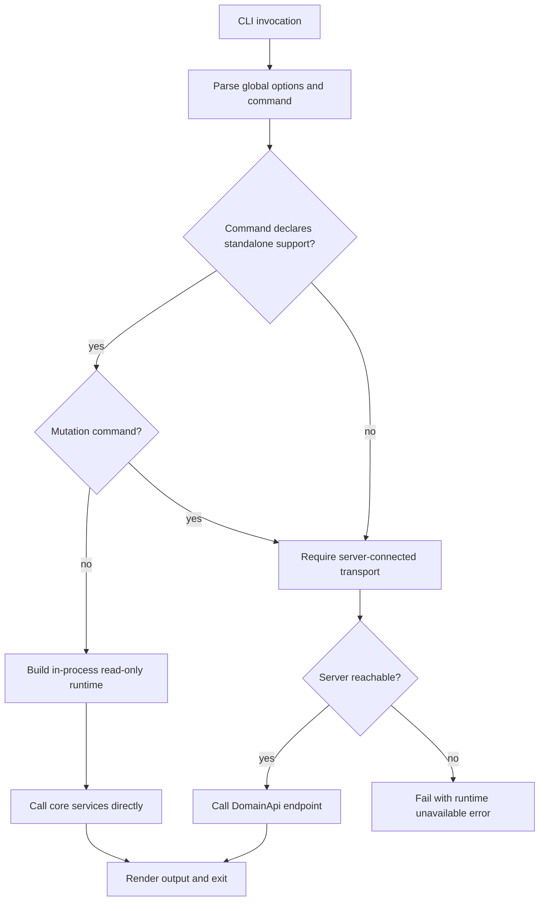

# SPEC-003: CLI Surface Contracts

## Status
Draft

## Purpose
Define the implementation contract for `ringi` as a first-class surface over the shared core service layer. This spec exists to make CLI behavior stable across human use, shell automation, and agent orchestration while preserving Ringi's local-first runtime model.

The immediate problems this spec resolves are:
- the CLI documentation describes three operational modes, but the runtime split between standalone reads and server-coordinated mutations needs explicit enforcement
- the todo command family has two competing verb sets in `docs/CLI.md`
- several documented CLI options do not map cleanly to the current service layer and must be called out explicitly instead of being hand-waved

## Scope
This spec covers:
- the canonical CLI command taxonomy for `review`, `todo`, `serve`, `mcp`, and the top-level `export` alias
- operational mode availability per command
- input contracts: positional arguments, flags, stdin/TTY assumptions, and confirmation behavior
- output contracts: human-readable stdout, JSON stdout, stderr diagnostics, and exit codes
- error taxonomy and exit code mapping
- server-connected transport selection and standalone direct-runtime behavior
- command-to-service mapping for the core review and todo workflows

## Non-Goals
This spec does not cover:
- Web UI interaction design
- MCP tool schemas or sandbox behavior beyond `ringi mcp` process startup
- HTTP endpoint design beyond the CLI-facing implications of the current `DomainApi`
- review lifecycle semantics themselves; those remain defined by `docs/specs/review-lifecycle.md`
- database lifecycle/schema changes except where command behavior depends on them
- `source`, `events`, `doctor`, and `data` command families as full primary scope; they are referenced only where needed to keep mode semantics honest

## Canonical References
- `docs/CLI.md`
  - Overview
  - Input/Output Conventions
  - Operational Modes
  - Global Options
  - `ringi serve`
  - `ringi review *`
  - `ringi todo *`
  - `ringi export`
  - `ringi mcp`
  - JSON Output Convention
  - Error Behavior
- `docs/ARCHITECTURE.md`
  - §7 Operational Modes
  - §8 Core Runtime Model
  - §10 Component Architecture
  - §19 CLI / Server / Web UI / MCP Relationship
  - §22 Observability and Diagnostics
  - §24 Failure Modes
- `docs/specs/review-lifecycle.md`
  - current lifecycle mismatch analysis
  - DD-1 split lifecycle fields
  - DD-4 approved reviews reopen on new unresolved work
- `src/routes/api/-lib/services/review.service.ts`
- `src/routes/api/-lib/services/todo.service.ts`
- `src/routes/api/-lib/services/comment.service.ts`
- `src/routes/api/-lib/services/export.service.ts`
- `src/api/domain-api.ts`
- `src/api/domain-rpc.ts`
- `src/api/schemas/review.ts`
- `src/api/schemas/todo.ts`
- `src/routes/api/$.ts`

## Terminology
- **Standalone mode**: CLI execution path that opens local state in-process for read-only commands and does not require a running server.
- **Server-connected mode**: CLI execution path that talks to the local Ringi HTTP server for mutations, runtime startup, and live coordination.
- **MCP stdio mode**: `ringi mcp`, which starts a dedicated stdio runtime for agent clients.
- **Command family**: noun-first top-level or subcommand grouping such as `review` or `todo`.
- **Read-only command**: a command that must not mutate repository state, review state, or local DB state.
- **Mutation command**: a command that changes review, comment, todo, export, or runtime state and therefore requires serialized coordination.
- **Canonical command name**: the verb spelling that MUST appear in help text, docs, shell completions, and examples.
- **Deprecated command name**: a legacy synonym that may be accepted temporarily for compatibility but is not canonical.

## Requirements
1. **REQ-003-001 — Canonical taxonomy**  
   The canonical review command family SHALL be `review create|list|show|export|resolve|status`. The canonical todo command family SHALL be `todo add|list|done|undone|move|remove|clear`.
2. **REQ-003-002 — Todo naming cutover**  
   `todo create|complete|uncomplete|delete` SHALL be treated as deprecated documentation-era synonyms. They SHALL NOT appear in help output, examples, or completion metadata. If implemented as compatibility aliases, they SHALL emit a deprecation warning to stderr and map to the canonical verbs.
3. **REQ-003-003 — Mode honesty**  
   Each command SHALL declare whether it supports standalone mode, server-connected mode, or runtime startup. Commands SHALL NOT silently downgrade from a required server-connected path to a local write path.
4. **REQ-003-004 — Standalone reads**  
   `review list`, `review show`, `review status`, `review export`, the top-level `export` alias, and `todo list` SHALL work without a running server by constructing an in-process read-only runtime over repository discovery, SQLite, and the necessary core services.
5. **REQ-003-005 — Server-coordinated mutations**  
   `review create`, `review resolve`, `todo add`, `todo done`, `todo undone`, `todo move`, `todo remove`, and `todo clear` SHALL require server-connected mode and SHALL fail fast if the server is unavailable.
6. **REQ-003-006 — Canonical server transport**  
   In server-connected mode, the CLI SHALL use `src/api/domain-api.ts` as its canonical adapter contract. `src/api/domain-rpc.ts` SHALL NOT be the CLI contract because it exposes reviews only and cannot satisfy todo/export/runtime workflows.
7. **REQ-003-007 — CLI is not a thin HTTP client**  
   The CLI SHALL own repository discovery, mode selection, flag validation, interactive confirmation rules, output rendering, and error mapping. HTTP is only the server-connected transport, not the CLI's entire behavior model.
8. **REQ-003-008 — Stable output separation**  
   Command data SHALL go to stdout. Diagnostics, warnings, and errors SHALL go to stderr. Human-readable success output MAY be suppressed with `--quiet`. JSON output SHALL use the standard `{ ok, data, error? }` envelope from `docs/CLI.md`.
9. **REQ-003-009 — Stable exit codes**  
   The CLI SHALL use the exit code mapping defined in this spec and SHALL keep empty read results as success (`0`).
10. **REQ-003-010 — Prompt discipline**  
    Destructive or approval-significant commands MAY prompt only when stdout/stderr are attached to a TTY. In non-interactive contexts, those commands SHALL require `--yes` and otherwise fail with exit code `2`.
11. **REQ-003-011 — Pipe behavior**  
    Pipe or redirect detection SHALL NOT implicitly switch structured commands to JSON. Human-readable output remains the default unless `--json` is passed. Non-TTY detection MAY disable ANSI color and interactive prompts.
12. **REQ-003-012 — Lifecycle enforcement**  
    Commands that change review lifecycle state SHALL enforce the lifecycle rules defined in `docs/specs/review-lifecycle.md` instead of mutating `reviews.status` generically.
13. **REQ-003-013 — Review resolve orchestration**  
    `review resolve` SHALL be implemented as an explicit lifecycle operation, not as a raw `ReviewService.update(id, status)` call. It SHALL resolve the intended unresolved work and then transition the review through the lifecycle-safe service boundary.
14. **REQ-003-014 — Export snapshot truthfulness**  
    `review export` and `export` SHALL operate on the stored review snapshot, never on live git state.
15. **REQ-003-015 — Long-running runtime commands**  
    `serve` SHALL start the HTTP/SSE runtime and wire the file watcher; `mcp` SHALL start a separate stdio runtime and SHALL NOT depend on `serve`.
16. **REQ-003-016 — Service mapping completeness**  
    Every command in scope SHALL map to a primary service or bounded orchestration over core services.
17. **REQ-003-017 — Error category truthfulness**  
    User input errors, missing resources, unavailable required runtime/state, auth failures, and generic runtime failures SHALL remain distinguishable at both stderr and exit-code levels.

## Workflow / State Model
### Command mode resolution


### Command execution pipeline
1. Discover repository root from CWD or `--repo`.
2. Validate command/flag combination before opening transport.
3. Resolve execution mode from command contract; do not guess from server presence alone.
4. Execute either:
   - standalone in-process read-only service path, or
   - server-connected HTTP path, or
   - runtime startup path (`serve` / `mcp`).
5. Render human-readable or JSON output.
6. Map domain/transport failures to the stable exit-code table.

### Review lifecycle interaction
This spec does not redefine lifecycle states. It requires CLI commands to respect `docs/specs/review-lifecycle.md`:
- `review create` enters the creation/analyzing flow through review services
- `review resolve` is an approval-oriented lifecycle mutation and MUST use an explicit lifecycle-safe orchestration
- `review export` MUST honor export preconditions from the lifecycle spec once that split-field model lands

## API / CLI / MCP Implications
### Command taxonomy and mode matrix
| Command | Standalone | Server-connected | Runtime startup | Canonical transport | Primary service mapping | Notes |
| --- | --- | --- | --- | --- | --- | --- |
| `ringi serve` | No | Starts it | Yes | N/A | runtime bootstrap over shared service layer | Must start HTTP routes, SSE, SQLite, and watcher wiring. |
| `ringi mcp` | No | No | Yes | stdio runtime | runtime bootstrap over shared service layer | Separate process; not a sub-mode of `serve`. |
| `ringi review create` | No | Yes | No | HTTP `POST /api/reviews` | `ReviewService.create` | Source parsing stays in CLI adapter; mutation stays server-coordinated. |
| `ringi review list` | Yes | Yes | No | standalone direct or HTTP `GET /api/reviews` | `ReviewService.list` | Pagination and filters map directly. |
| `ringi review show <id|last>` | Yes | Yes | No | standalone direct or HTTP `GET /api/reviews/:id` plus optional related reads | `ReviewService.getById` + optional `CommentService.getByReview` + `TodoService.list` | `last` resolution is CLI-side selection before service call. |
| `ringi review export <id|last>` | Yes | Yes | No | standalone direct or HTTP `GET /api/reviews/:id/export/markdown` | `ExportService.exportReview` | Export options require service support; see Open Questions. |
| `ringi export <id|last>` | Yes | Yes | No | same as above | same as above | Canonical alias of `review export`. |
| `ringi review resolve <id|last>` | No | Yes | No | HTTP orchestration endpoint or equivalent lifecycle endpoint | explicit lifecycle operation over `CommentService` + review lifecycle service | Current `ReviewService.update` is insufficient and SHALL NOT be the final contract. |
| `ringi review status` | Yes | Yes | No | standalone direct or HTTP composite reads | composite over `GitService`, `ReviewService`, `CommentService`, `TodoService` | Status is an adapter-level composition, not a single current service method. |
| `ringi todo add` | No | Yes | No | HTTP `POST /api/todos` plus ordered placement handling | `TodoService.create` | `--position` is not currently modeled in `CreateTodoInput`; see Open Questions. |
| `ringi todo list` | Yes | Yes | No | standalone direct or HTTP `GET /api/todos` | `TodoService.list` | Read-only and standalone-capable. |
| `ringi todo done <id>` | No | Yes | No | HTTP `PATCH /api/todos/:id` or `/toggle` | `TodoService.update` or `TodoService.toggle` | CLI contract is explicit completion, not blind toggle. |
| `ringi todo undone <id>` | No | Yes | No | HTTP `PATCH /api/todos/:id` or `/toggle` | `TodoService.update` or `TodoService.toggle` | Same rule: explicit target state preferred over implicit toggle. |
| `ringi todo move <id>` | No | Yes | No | HTTP `PATCH /api/todos/:id/move` | `TodoService.move` | Ordered mutation, server-required. |
| `ringi todo remove <id>` | No | Yes | No | HTTP `DELETE /api/todos/:id` | `TodoService.remove` | Destructive; confirmation rules apply. |
| `ringi todo clear` | No | Yes | No | HTTP `DELETE /api/todos/completed` or future scoped clear endpoint | `TodoService.removeCompleted` plus optional future scoped clear service | Current HTTP API only supports global completed-clear. Review-scoped/all-item clear is unresolved. |

### Input contracts
#### Global options
| Option | Contract |
| --- | --- |
| `--json` | Emit JSON envelope to stdout. Never implied by pipe detection. |
| `--quiet` | Suppress human-readable success output only. Errors still go to stderr. |
| `--repo <path>` | Override repository discovery root. |
| `--verbose` | Add diagnostics and stack traces to stderr only. |
| `--no-color` | Disable ANSI color in human-readable output. |

#### Review commands
| Command | Positional args | Key flags | Interactive behavior |
| --- | --- | --- | --- |
| `review create` | none | `--source`, `--branch`, `--commits` | Never prompts. Invalid flag/source combinations are usage errors. |
| `review list` | none | `--status`, `--source`, `--limit`, `--page` | Never prompts. |
| `review show` | `<id|last>` | `--comments`, `--todos` | Never prompts. |
| `review export` / `export` | `<id|last>` | `--output`, `--stdout`, `--no-resolved`, `--no-snippets` | Never prompts. |
| `review resolve` | `<id|last>` | `--all-comments`, `--yes` | MAY prompt on TTY because it changes approval state; MUST fail with code `2` in non-TTY mode without `--yes`. |
| `review status` | none | `--review`, `--source` | Never prompts. |

#### Todo commands
| Command | Positional args | Key flags | Interactive behavior |
| --- | --- | --- | --- |
| `todo add` | none | `--text`, `--review`, `--position` | Never prompts. |
| `todo list` | none | `--review`, `--status`, `--limit`, `--offset` | Never prompts. |
| `todo done` | `<id>` | none | Never prompts. |
| `todo undone` | `<id>` | none | Never prompts. |
| `todo move` | `<id>` | `--position` | Never prompts. |
| `todo remove` | `<id>` | `--yes` | MAY prompt on TTY; MUST fail with code `2` in non-TTY mode without `--yes`. |
| `todo clear` | none | `--review`, `--done-only`, `--all`, `--yes` | MAY prompt on TTY; MUST fail with code `2` in non-TTY mode without `--yes`. |

### Output contracts
#### Human-readable stdout
- `review list`: compact table or empty-state summary
- `review show`: review metadata, source, summary, files, optional comment/todo summaries
- `review export` / `export`: markdown content to stdout unless only writing to file
- `review status`: concise repository/review status summary
- `todo list`: ordered todo lines
- todo mutations: terse confirmation line unless `--quiet`
- `serve` / `mcp`: readiness and runtime diagnostics SHOULD go to stderr, not stdout, because they are long-running process commands rather than data emitters

#### JSON stdout
All JSON-capable commands SHALL emit:
```ts
{
  ok: boolean;
  data: T | null;
  error?: string;
}
```
Rules:
- `ok: true` with empty arrays is still success
- `data: null` is reserved for side-effect-only success cases
- `ok: false` MUST pair with non-zero exit code
- stderr still carries human diagnostic detail when useful

### Exit code table
| Code | Category | Meaning | Typical examples |
| --- | --- | --- | --- |
| `0` | Success | Command satisfied its contract, including empty read results. | `review list` with no matches, `todo list` with no items, successful export generation |
| `2` | Usage error | Invalid arguments, invalid flag combinations, or missing required confirmation in non-interactive mode. | `review create --source branch` without `--branch`, `todo move` without `--position`, destructive command without `--yes` in non-TTY mode |
| `3` | Resource not found | Requested review or todo does not exist after selector resolution. | unknown review id, `last` with no matching review for `show`/`export`/`resolve`, unknown todo id |
| `4` | Required local runtime/state unavailable | The command cannot access the required local repository state or required local server runtime. | missing `.ringi/reviews.db`, invalid repo root, mutation command with no reachable local server |
| `5` | Auth failure | Auth configuration or auth handshake failed for a command that uses protected server runtime. | `serve --auth` missing credentials, protected server rejects request |
| `1` | Generic runtime/domain failure | Storage, transport, git, export, lifecycle-precondition, or unexpected runtime failure. | export render failure, git diff failure, lifecycle precondition rejection, SQLite read/write error |

### HTTP API implications
- `DomainApi` is broad enough for review, todo, export, and event workflows.
- `DomainRpc` only exposes review operations (`list`, `getById`, `create`, `update`, `remove`, `stats`) and therefore is insufficient as the CLI contract for server-connected mode.
- CLI-specific adapter logic still owns `last` resolution, prompt handling, output formatting, and fallback-free mode enforcement.

### MCP implications
- `ringi mcp` is a runtime command, not a data command.
- The CLI contract for `mcp` is process startup, stderr diagnostics, and exit behavior only.
- MCP namespace/tool semantics remain defined by `docs/MCP.md`, not by this spec.

## Data Model Impact
No new tables or columns are introduced by this spec.

This spec does, however, depend on truthful service contracts over existing persisted data:
- review exports must read persisted snapshot-backed review data
- standalone reads depend on SQLite WAL/read concurrency already described in architecture
- lifecycle-safe approval/export behavior depends on the split lifecycle model specified in `docs/specs/review-lifecycle.md`

## Service Boundaries
| Layer | Owns | Must not own |
| --- | --- | --- |
| CLI adapter | arg parsing, mode selection, `last` resolution, prompt rules, output rendering, exit code mapping | business lifecycle logic, direct git mutations for review/todo writes |
| `ReviewService` | review creation, listing, detail, file hunks, review lifecycle entrypoints | CLI prompts, HTTP details, live server discovery |
| `TodoService` | todo CRUD, ordering, stats | CLI verb naming, confirmation rules |
| `CommentService` | comment listing/resolution for review workflows | review approval decisions by itself |
| `ExportService` | export rendering from persisted review/comment/todo data | CLI file-path prompting and shell UX |
| `GitService` | repository metadata and diff/source inspection | review lifecycle state |
| HTTP `DomainApi` | server-connected transport adapter | CLI-specific defaults and output formatting |
| RPC `DomainRpc` | review-only typed transport | complete CLI transport surface |

## Edge Cases
1. **Server not running for a mutation command**  
   The CLI SHALL fail fast. It SHALL NOT mutate SQLite directly as a fallback. stderr SHALL explain that the command requires server-connected mode and suggest `ringi serve`.
2. **Invalid review ID format**  
   **AMBIGUITY:** `ReviewId` and `TodoId` are branded strings in `src/api/schemas/review.ts` and `src/api/schemas/todo.ts`; there is no regex or prefix contract to distinguish malformed ids from merely unknown ids. Proposed resolution: treat empty/whitespace ids as usage error (`2`) and pass non-empty ids through until a stronger schema spec defines an exact format.
3. **`last` selector with no matching review**  
   Resolve `last` in the CLI adapter after listing the repository's reviews ordered by creation time. If no review exists, return exit code `3` for commands that require a review (`show`, `export`, `resolve`) and exit code `0` with empty-state output for `status`.
4. **Review in wrong lifecycle state**  
   If a requested operation violates lifecycle preconditions from `docs/specs/review-lifecycle.md`, the command SHALL fail truthfully with a domain-precondition error on stderr and exit code `1` until a dedicated precondition code is standardized.
5. **Concurrent CLI invocations against the same SQLite store**  
   Standalone commands are read-only and rely on SQLite WAL concurrency. Mutations stay server-coordinated so only one write path owns ordering and lifecycle decisions.
6. **Very long output**  
   `review list` and `todo list` SHALL page/offset rather than truncate silently. `review show` and `review export` SHALL emit full payloads; truncation is the caller's job.
7. **Pipe/redirect detection**  
   Piping SHALL disable prompts and MAY disable color. It SHALL NOT auto-enable JSON. `review export` continues to emit markdown to stdout by default because stdout is the product output for that command.
8. **Ctrl+C / signal interruption**  
   **AMBIGUITY:** signal exit behavior is not currently documented. Proposed resolution: long-running commands (`serve`, `mcp`, future streams) should allow the shell's conventional signal exit behavior instead of remapping signals into generic exit code `1`.
9. **`todo add --position` race**  
   Current `TodoService.create` does not accept position. A create-then-move adapter sequence would be two writes and is race-prone. This requires service-level resolution before claiming full support.
10. **`review export --no-resolved` / `--no-snippets` mismatch**  
    Current `ExportService.exportReview(reviewId)` has no options. CLI flags exist in docs but are not backed by the current service signature.
11. **`review create --title` mismatch**  
    **AMBIGUITY:** `docs/CLI.md` documents `--title`, but `CreateReviewInput` currently contains only `sourceType` and `sourceRef`. Until review metadata grows a title field, the flag MUST remain undocumented in generated help or fail with usage error instead of being silently ignored.
12. **`review resolve` service gap**  
    Current `ReviewService` exposes only generic `update(id, status)`, while review-lifecycle spec explicitly rejects that as the long-term contract. `review resolve` therefore requires a new explicit lifecycle operation.
13. **`serve` watcher wiring gap**  
    `EventService.startFileWatcher` exists, but `src/routes/api/$.ts` does not invoke it during server boot. `serve` is not fully compliant with architecture until that boot path starts the watcher.

## Observability
The CLI surface SHALL expose enough diagnostics to explain mode and transport failures locally:
- `--verbose` adds transport details, stack traces, and service error context to stderr only
- server-required command failures SHOULD say whether the server was unreachable, refused the connection, or returned a typed domain error
- standalone read paths SHOULD log repository discovery path, DB path, and selected mode in verbose mode
- `serve` SHOULD log bind address, auth mode, SQLite initialization, and watcher startup outcome
- `mcp` SHOULD log readonly/full mode, namespace availability, and bootstrap failures to stderr
- deprecation warnings for old todo verb names SHOULD be emitted to stderr once per invocation

## Rollout Considerations
1. Cut over docs, help text, completions, and tests to the canonical todo verbs in one change.
2. Keep deprecated todo synonyms only if needed for short-term compatibility; remove them once callers are migrated.
3. Ship standalone implementations for `review list`, `review show`, `review status`, `review export`, and `todo list` before advertising local-first parity.
4. Do not advertise `review resolve` as complete until the lifecycle-safe service operation exists.
5. Do not advertise `review create --title`, `review export --no-resolved`, `review export --no-snippets`, or `todo add --position` as implemented until the underlying service contracts are extended.
6. `serve` should not claim full server-connected parity until watcher boot wiring is active.
7. RPC may remain for internal review clients, but CLI documentation and implementation should standardize on HTTP `DomainApi` for server-connected mode.

## Open Questions
1. **What is the exact review/todo id format?**  
   Current schemas only brand strings. Proposed resolution: define regex-backed ids in a separate API/schema spec, then upgrade CLI validation from weak to strong.
2. **Should deprecated todo verbs remain executable aliases or become hard errors immediately?**  
   Proposed resolution: one release of stderr deprecation warnings if aliases already exist in shipped code; otherwise hard cutover with no aliases.
3. **How should `review resolve` map into the lifecycle service?**  
   Proposed resolution: add an explicit review lifecycle service method such as `approve(reviewId, options)` rather than reusing `update(id, status)`.
4. **How should export filtering flags be implemented?**  
   Proposed resolution: extend `ExportService.exportReview(reviewId, options)` so filtering remains inside the export domain boundary.
5. **How should `todo add --position` be made atomic?**  
   Proposed resolution: extend `TodoService.create` with an optional position parameter and perform insertion/reordering inside one service-level write boundary.
6. **What exit code should lifecycle-precondition failures use long term?**  
   Proposed resolution: keep exit code `1` for now to stay within the current documented table; revisit only if multiple precondition cases become operationally important.
7. **Should `serve` startup fail hard if the watcher cannot start?**  
   Proposed resolution: fail hard when watcher-backed live features are advertised as available; otherwise surface degraded mode explicitly.

## Acceptance Criteria
- `docs/specs/cli-surface-contracts.md` exists as `SPEC-003`.
- The spec contains all mandatory sections required by the project spec template.
- The canonical todo verbs are `add|list|done|undone|move|remove|clear`.
- Deprecated todo verbs `create|complete|uncomplete|delete` are explicitly called out as deprecated and non-canonical.
- The spec includes a stable exit-code table and error taxonomy.
- The spec states that `review list`, `review show`, `review status`, `review export`, `export`, and `todo list` work in standalone mode.
- The spec states that review/todo mutations require server-connected mode and do not silently fall back to direct SQLite writes.
- The spec states that server-connected CLI uses `DomainApi` as the canonical transport and that `DomainRpc` is insufficient for the full CLI surface.
- Every command in scope is mapped to its operational mode availability and primary core service call.
- The spec explicitly flags current source/doc mismatches for `review create --title`, `review resolve`, `review export` filtering flags, `todo add --position`, and watcher boot wiring.
- The spec cross-references `docs/specs/review-lifecycle.md` for lifecycle-sensitive CLI behavior instead of redefining lifecycle rules here.
