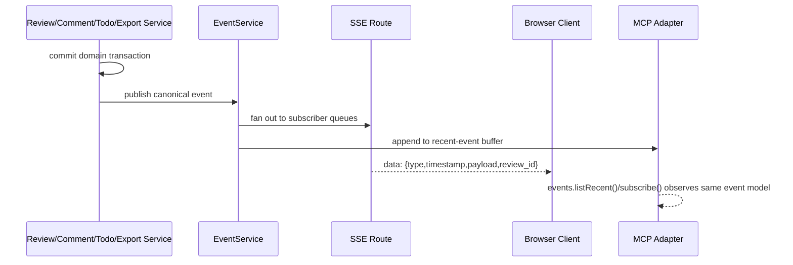

# SPEC-007: Events and Realtime

## Status
Draft

## Purpose
Define the implementation contract for Ringi realtime delivery: in-process event publication, watcher-driven file change detection, SSE delivery to UI clients, and MCP event access backed by the same core runtime. This spec exists so review state changes, file invalidation, and agent-visible events flow through one truthful event model instead of ad hoc refresh logic.

## Scope
This spec covers:
- the canonical event taxonomy for review, comment, todo, file, and intelligence updates
- the in-process `EventService` pub/sub model and its relationship to transports
- server-sent events delivery to browser clients over `GET /api/events`
- file watcher activation, watch scope, debounce rules, and propagation into review-scoped invalidation
- MCP `events` namespace implications from `docs/MCP.md`
- the standardized event envelope and delivery guarantees
- connection lifecycle rules for SSE subscribers and multiple concurrent clients
- current implementation gaps where docs and source do not yet match

## Non-Goals
This spec does not cover:
- introducing an external broker, queue, or hosted pub/sub service
- replacing local-first read behavior with a server requirement for standalone CLI reads
- frontend cache implementation details beyond the transport contract
- detailed lifecycle semantics already specified in `docs/specs/review-lifecycle.md`
- detailed persistence schema changes beyond the optional event-buffer/cursor data needed for realtime delivery
- generic repository-wide event streaming outside the current repository context

## Canonical References
- `docs/ARCHITECTURE.md`
  - §6 `System Overview`
  - §7 `Operational Modes`
  - §8 `Core Runtime Model`
  - §9 `Domain Boundaries`
  - §10 `Component Architecture`
  - §11 `Data Flow`
  - §13 `Eventing and Realtime Strategy`
  - §18 `Agent Integration Strategy`
  - §19 `CLI / Server / Web UI / MCP Relationship`
  - §22 `Observability and Diagnostics`
  - §24 `Failure Modes`
- `docs/MCP.md`
  - `API Surface` → `events`
  - examples using `events.subscribe(...)` and `events.listRecent(...)`
- `docs/specs/review-lifecycle.md`
  - lifecycle states and transition table
  - DD-4 reopening approved reviews on new unresolved work
  - DD-5 export terminality
  - §7.3 event rate / batching
- `docs/specs/core-service-boundaries.md`
  - REQ-006-013 post-commit events only
  - REQ-006-016 `EventService` ownership
  - current implementation gaps around watcher boot
- `src/routes/api/-lib/services/event.service.ts`
- `src/routes/api/-lib/services/git.service.ts`
- `src/routes/api/$.ts`
- `src/routes/api/-lib/wiring/events-api-live.ts`
- `src/routes/-shared/hooks/use-event-source.ts`

## Terminology
- **Realtime event** — a structured, in-process message emitted after a completed domain fact or file watcher observation.
- **Event envelope** — the transport shape delivered to SSE clients or MCP consumers.
- **Event category** — the coarse top-level domain bucket currently used in source (`reviews`, `comments`, `todos`, `files`) and in `docs/ARCHITECTURE.md` (`intelligence` is also required there).
- **Event type** — the canonical fine-grained event name such as `reviews.workflow_changed` or `files.changed`.
- **Subscriber** — one in-memory consumer queue registered with `EventService.subscribe()`.
- **Watch scope** — the repository root watched by chokidar for working-tree changes.
- **Review-scoped invalidation** — an event that identifies the affected review or explicitly states that no review was matched.
- **Buffered recent events** — the short-lived in-process event history needed by the MCP `events.listRecent(...)` contract described in `docs/MCP.md`.

## Requirements

### Event architecture
- REQ-007-001: Ringi SHALL use one in-process event bus owned by `EventService`; no external broker is introduced for Phase 1.
- REQ-007-002: `EventService` SHALL remain transport-adjacent infrastructure per SPEC-006: it fans out already-decided facts and watcher observations, but SHALL NOT decide review lifecycle or repository business rules.
- REQ-007-003: Domain mutation events SHALL be published only after the owning transaction commits successfully, per SPEC-006 REQ-006-013.
- REQ-007-004: Server-mediated realtime SHALL be available only in server-connected mode. Standalone CLI reads SHALL remain functional without SSE or a live watcher, consistent with `docs/ARCHITECTURE.md` §7 and SPEC-006 REQ-006-018.
- REQ-007-005: MCP event access SHALL expose the same canonical event model used by the server runtime; MCP SHALL NOT invent a second event vocabulary.

### Canonical envelope
- REQ-007-006: The canonical wire envelope SHALL be JSON with at least `{ type, timestamp, payload, review_id }`.
- REQ-007-007: `type` SHALL be the fine-grained event name from the taxonomy in this spec.
- REQ-007-008: `timestamp` SHALL be the server-side event creation time as Unix epoch milliseconds, matching the current `Date.now()` shape in `event.service.ts`.
- REQ-007-009: `review_id` SHALL be the affected review id when one review is known, or `null` when the event is repository-scoped only.
- REQ-007-010: `payload` SHALL contain the event-specific structured body; transports SHALL NOT overload `type` to encode payload fields.
- REQ-007-011: **AMBIGUITY:** current source uses `SSEEvent { type, data?, timestamp }` and omits `review_id`; the envelope cutover from `data` to `payload` and the exact compatibility plan are not implemented yet.

### Taxonomy and emission
- REQ-007-012: Ringi SHALL support the event taxonomy defined in this spec for review lifecycle, comments, todos, files, and intelligence invalidation/completion.
- REQ-007-013: Lifecycle events SHALL be emitted immediately for every successful lifecycle mutation; they SHALL NOT be debounced, consistent with SPEC-001 §7.3.
- REQ-007-014: Bulk lifecycle-affecting operations MAY emit one summary event instead of N per-row lifecycle events only where SPEC-001 explicitly allows it, e.g. `CommentService.resolveAllForReview()`.
- REQ-007-015: File watcher events SHALL be debounced before broadcast. The current 300ms debounce in `event.service.ts` is the minimum Phase 1 behavior.
- REQ-007-016: File watcher payloads SHALL be scoped to changed file paths and, when available, affected review ids. They SHALL NOT degrade to an unconditional “refresh everything” signal.
- REQ-007-017: File changes outside any active review scope SHALL emit a repository-scoped file event with `review_id = null`.
- REQ-007-018: Exported reviews SHALL remain terminal per SPEC-001. No lifecycle/comment/todo mutation event SHALL be emitted for an exported review because the mutation itself must fail.
- REQ-007-019: Repository-scoped file watcher events MAY still mention files that were once part of an exported review, but they SHALL NOT imply the exported review mutated.

### SSE transport
- REQ-007-020: The server SHALL expose `GET /api/events` as the SSE stream endpoint, matching `src/routes/api/$.ts` and `use-event-source.ts`.
- REQ-007-021: The SSE response SHALL use `content-type: text/event-stream`, `cache-control: no-cache`, and `connection: keep-alive`, matching current source.
- REQ-007-022: Each SSE message SHALL contain one serialized event envelope per `data:` frame.
- REQ-007-023: The server SHALL fan out the same published event to every connected SSE client.
- REQ-007-024: Disconnecting an SSE client SHALL unregister its queue from `EventService` and release resources.
- REQ-007-025: **AMBIGUITY:** current `SSERoute` subscribes and binds `unsubscribe` as `_unsubscribe` without invoking it, so disconnect cleanup is not yet wired in source.
- REQ-007-026: SSE reconnect behavior SHALL be at-least reconnect-attempting from the client side. The current UI hook retries after 1 second on `EventSource.onerror`.
- REQ-007-027: **AMBIGUITY:** current SSE transport does not emit event ids or support `Last-Event-ID`; exact replay behavior after network loss is therefore limited to best-effort reconnect plus client invalidation.

### File watcher lifecycle
- REQ-007-028: `ringi serve` SHALL start exactly one file watcher for the repository root after runtime initialization succeeds, consistent with `docs/ARCHITECTURE.md` §8.
- REQ-007-029: The watcher root SHALL come from repository resolution via `GitService`, not from duplicated path logic elsewhere.
- REQ-007-030: The watcher SHALL ignore at least `**/node_modules/**`, `**/.git/**`, `**/.ringi/**`, and `**/dist/**`, matching `event.service.ts`.
- REQ-007-031: On Darwin, polling-based watching MAY be used as in current source (`usePolling: true`, `interval: 1000`) to preserve local reliability.
- REQ-007-032: The watcher SHALL observe add, change, and unlink operations and normalize them into the canonical file-event taxonomy.
- REQ-007-033: **AMBIGUITY:** current source contains `EventService.startFileWatcher(repoPath)` but no verified call site invokes it, so watcher activation is currently a required cutover item rather than shipped runtime behavior.

### MCP events namespace
- REQ-007-034: The MCP `events` namespace SHALL expose `subscribe(...)` and `listRecent(...)` as documented in `docs/MCP.md`.
- REQ-007-035: MCP event filters SHALL accept `reviewId` and `eventTypes` using the canonical event names from this spec.
- REQ-007-036: `listRecent(...)` SHALL read from a short-lived in-process recent-event buffer, not from synthesized polling across reviews/comments/todos.
- REQ-007-037: **AMBIGUITY:** current source provides no verified `listRecent(...)` implementation or recent-event buffer.
- REQ-007-038: Because `execute(...)` calls are isolated per `docs/MCP.md`, MCP subscription lifetime SHALL be scoped to the current execute call unless and until a longer-lived streaming contract is introduced.

### Ordering and delivery semantics
- REQ-007-039: Ringi SHALL document delivery as in-order per subscriber queue at publication time, not as a global total-order guarantee across reconnects, queue overflow, or process restarts.
- REQ-007-040: The current subscriber queue size of 100 events per client, implemented via `Queue.sliding(100)`, SHALL be treated as lossy under sustained backpressure; oldest buffered events may be dropped.
- REQ-007-041: Event delivery SHALL be best-effort and in-memory only unless a future persistence-backed cursor mechanism is explicitly added.

## Workflow / State Model

### 1. Event publication flow


### 2. File watcher activation lifecycle
```mermaid
flowchart TD
  A[ringi serve boot] --> B[Build Effect runtime]
  B --> C[Initialize SQLite + migrations]
  C --> D[Resolve repository root via GitService]
  D --> E[Start EventService.startFileWatcher(repoPath)]
  E --> F[Watch add/change/unlink]
  F --> G[Debounce burst for 300ms minimum]
  G --> H[Publish files.changed/files.deleted]
  H --> I[SSE invalidation + MCP recent buffer]
```

### 3. SSE connection lifecycle
1. Client opens `EventSource("/api/events")`.
2. Server registers one queue via `EventService.subscribe()`.
3. Published events are serialized as `data: <json>\n\n`.
4. On transport failure, the current UI hook closes the socket and retries after 1 second.
5. On client disconnect or route disposal, the server MUST unsubscribe the queue.
6. If reconnect occurs, the client resumes from a fresh live stream; replay is best-effort only until a persistent cursor exists.

### 4. Lifecycle interaction rules
- `ReviewService.create()` participates in `created -> analyzing -> ready` per SPEC-001 and SHOULD emit review lifecycle events for the externally observable milestones.
- `CommentService.create()` and `CommentService.unresolve()` reopen approved reviews per SPEC-001 DD-4; the emitted event stream MUST tell the truth about that reopened state.
- `TodoService.create()` and review-linked todo reopen also reopen approved reviews per SPEC-001 DD-4 and therefore require corresponding review/todo events.
- `ExportService.exportReview()` terminals the snapshot via `exported_at` per SPEC-001 DD-5 and SHALL emit one terminal review export event after the transaction commits.
- **AMBIGUITY:** current source shows no verified domain-service call sites publishing lifecycle/comment/todo events through `EventService`; only explicit `/events/notify` and watcher broadcasts are implemented.

## API / CLI / MCP Implications

### Event taxonomy table
| Canonical type | Category | Trigger source | `review_id` | Minimum payload | Source basis |
| --- | --- | --- | --- | --- | --- |
| `reviews.created` | review | `ReviewService.create()` completes persisted creation | required | `{ workflow_state, source_type, file_count }` | ARCH §11, SPEC-001 create flow |
| `reviews.workflow_changed` | review | `created -> analyzing -> ready -> in_review` transitions | required | `{ from, to, row_version }` | SPEC-001 transition table |
| `reviews.decision_changed` | review | `approve`, `requestChanges`, `reopen` | required | `{ from, to, row_version }` | SPEC-001 transition table |
| `reviews.exported` | review | first successful export | required | `{ exported_at, decision }` | SPEC-001 DD-5 |
| `comments.created` | comment | `CommentService.create()` | required | `{ comment_id, file_path, resolved, has_suggestion }` | current service methods + SPEC-001 child rules |
| `comments.updated` | comment | `CommentService.update()` | required | `{ comment_id, file_path }` | current service methods |
| `comments.resolved` | comment | `CommentService.resolve()` | required | `{ comment_id, file_path }` | current service methods |
| `comments.unresolved` | comment | `CommentService.unresolve()` | required | `{ comment_id, file_path }` | current service methods + SPEC-001 DD-4 |
| `comments.deleted` | comment | `CommentService.remove()` | required | `{ comment_id, file_path }` | current service methods |
| `todos.created` | todo | `TodoService.create()` | `null` or required when linked | `{ todo_id, completed }` | current service methods + ARCH event types |
| `todos.updated` | todo | `TodoService.update()` | `null` or required when linked | `{ todo_id, completed }` | current service methods |
| `todos.toggled` | todo | `TodoService.toggle()` | `null` or required when linked | `{ todo_id, completed }` | current service methods |
| `todos.reordered` | todo | `TodoService.reorder()` / `move()` | `null` or required when linked | `{ updated }` or `{ todo_id, position }` | current service methods |
| `todos.deleted` | todo | `TodoService.remove()` / `removeCompleted()` | `null` or required when linked | `{ todo_id? , deleted? }` | current service methods |
| `files.changed` | file | watcher `add` / `change` | optional | `{ path, op }` | `event.service.ts`, docs/MCP |
| `files.deleted` | file | watcher `unlink` | optional | `{ path, op: "unlink" }` | `event.service.ts` normalized |
| `intelligence.updated` | intelligence | analysis completed for a review snapshot | required | `{ phase, status }` | ARCH §13 required event types |
| `intelligence.invalidated` | intelligence | watcher or refresh invalidates derived intelligence | optional or required | `{ path?, reason }` | ARCH §13 invalidation hints |

### SSE endpoint contract
```http
GET /api/events
Accept: text/event-stream
```

Successful response:
- status `200`
- headers:
  - `content-type: text/event-stream`
  - `cache-control: no-cache`
  - `connection: keep-alive`
- body frames:
```text
data: {"type":"files.changed","timestamp":1710000000000,"review_id":"rev_123","payload":{"path":"src/foo.ts","op":"change"}}

```

Client behavior implications:
- the current browser hook connects to `/api/events` by default and invalidates TanStack Router state on each message
- the client reconnects after 1 second on transport failure
- until event replay exists, reconnect SHOULD trigger slice invalidation rather than assuming no events were missed

### Current transport surface versus target surface
- Current source already exposes `GET /api/events` in `src/routes/api/$.ts`; the missing cutover is watcher boot and canonical envelope richness, not endpoint existence.
- Current typed HTTP API also exposes `/events/notify` and `/events/clients` via `EventsApiLive`, but those endpoints use the coarse category type (`todos|reviews|comments|files`) and a minimal `{ action? }` payload.
- **AMBIGUITY:** `docs/ARCHITECTURE.md` says the current code already has `/api/events`; the assignment input claiming no SSE endpoint exists is contradicted by `src/routes/api/$.ts`.

### CLI implications
- `docs/ARCHITECTURE.md` says CLI `events` mode should tail the same SSE stream. Until that command exists, SSE remains the canonical live transport contract for human-facing realtime.
- Standalone CLI reads do not require watcher or SSE boot.

### MCP implications
- `docs/MCP.md` currently documents four event names: `reviews.updated`, `comments.updated`, `todos.updated`, `files.changed`.
- This spec tightens that coarse `.updated` shape into explicit canonical event names so agents can distinguish lifecycle decisions, export terminality, and comment/todo reopen semantics without polling every slice.
- **AMBIGUITY:** the compatibility mapping from `reviews.updated` to `reviews.workflow_changed` / `reviews.decision_changed` / `reviews.exported` is not yet implemented and must be resolved before cutover.

## Data Model Impact
This spec does not require an external broker or durable event log.

It does require the following data-shape decisions:
- the event envelope grows from current `SSEEvent { type, data?, timestamp }` to canonical `{ type, timestamp, payload, review_id }`
- a short-lived in-memory recent-event buffer is needed to satisfy `events.listRecent(...)` as documented in `docs/MCP.md`
- if replay beyond in-memory recent history is required later, a separate persisted cursor or event table must be introduced explicitly; this spec does not require that for Phase 1

Current in-memory state already present in source:
- `subscribers: Set<Queue.Queue<SSEEvent>>`
- one sliding queue of size `100` per subscriber
- no verified recent-event buffer
- no persisted event cursor or event table

## Service Boundaries
- `EventService` owns subscriber registration, queue fanout, watcher lifecycle, and transport-oriented event serialization inputs.
- `EventService` does not own review/comment/todo business decisions; mutating services decide the fact, then publish after commit.
- `GitService` remains the repository adapter used to resolve the repository root for watcher startup; it does not publish events by itself.
- HTTP/SSE adapters own request/response transport concerns, including opening `GET /api/events`, streaming frames, and disconnect cleanup.
- MCP adapters own sandbox exposure of `events.subscribe(...)` and `events.listRecent(...)`.
- UI hooks own reconnect policy and cache invalidation strategy; they do not infer review semantics from thin transport failures.
- **AMBIGUITY:** review-to-file watcher scoping cannot currently live inside `EventService` without adding a read collaborator or an outer orchestration step, because SPEC-006 forbids `EventService` from depending on review-domain services to decide what happened.

## Edge Cases
- **Very large repositories:** chokidar bursts SHALL be debounced; the current 300ms debounce plus Darwin polling fallback is the minimum behavior. Queue overflow remains possible because subscriber queues are sliding and bounded to 100.
- **SSE reconnection after network drop:** the current client retries after 1 second. Because there is no `Last-Event-ID` support, reconnect is best-effort and clients must revalidate affected slices.
- **Review already exported:** lifecycle/comment/todo mutations fail per SPEC-001, so no mutation event is emitted. Repository file changes may still emit repository-scoped `files.*` events.
- **Multiple UI clients:** all connected clients receive the same published event independently through their own queues. Slow consumers may lose oldest buffered events due to `Queue.sliding(100)`.
- **File changes outside review scope:** emit `files.*` with `review_id = null`; clients may ignore it or use it for repository-level staleness indicators.
- **Client disconnect cleanup:** current source does not invoke the returned `unsubscribe` finalizer, so subscriber leakage is a real implementation risk until fixed.
- **MCP long-running subscriptions:** `docs/MCP.md` says each `execute` call is isolated, so event subscriptions cannot assume process-global agent session state across calls.
- **Docs/source mismatch:** architecture and UI hook show SSE exists; watcher boot and richer event taxonomy do not.

## Observability
Required diagnostics, grounded in `docs/ARCHITECTURE.md` §22 and SPEC-006:
- watcher start/stop status and last observed filesystem event timestamp
- connected SSE client count
- per-category and per-type event counters
- number of dropped buffered events per subscriber when sliding queues overflow
- last successful publish timestamp
- MCP recent-buffer size and oldest/newest buffered event timestamps once implemented
- reconnect/error counts from SSE clients where frontend diagnostics are available

Minimum logging expectations:
- server boot logs watcher activation with repository root
- `EventService` logs subscriber count changes
- event publish logs category/type, `review_id`, and payload summary without dumping large blobs
- watcher logs normalized file operation (`add`, `change`, `unlink`) and relative path
- SSE adapter logs stream open/close and transport errors

## Rollout Considerations
1. Keep the current in-process bus; do not introduce Redis, NATS, or any external broker.
2. Cut over the envelope from `{ type, data, timestamp }` to `{ type, timestamp, payload, review_id }` with one canonical representation across SSE and MCP.
3. Wire `EventService.startFileWatcher()` during server boot after runtime initialization and repository-root resolution succeed.
4. Normalize coarse category broadcasts into the canonical taxonomy table in this spec.
5. Add disconnect finalization so SSE subscriber queues are removed on stream close.
6. Add the in-memory recent-event buffer required for MCP `events.listRecent(...)`.
7. Update UI invalidation to consume structured payloads, not only category-wide refreshes.
8. Add domain-service post-commit publication for review/comment/todo/export transitions.
9. Resolve the MCP compatibility story for documented `.updated` event names versus the more explicit canonical taxonomy in this spec.

## Open Questions
1. **AMBIGUITY:** Should canonical wire fields stay exactly `{ type, timestamp, payload, review_id }`, or should TypeScript-facing adapters expose a camelCase view such as `reviewId` while preserving the snake_case wire contract?
2. **AMBIGUITY:** Where should file-path-to-review-id scoping happen for watcher events: a read-only review lookup collaborator, an outer orchestration layer, or the UI cache layer?
3. **AMBIGUITY:** Should `intelligence.updated` and `intelligence.invalidated` ship in Phase 1 even though current source has no verified intelligence event publisher?
4. **AMBIGUITY:** Should MCP preserve documented coarse names (`reviews.updated`, `comments.updated`, `todos.updated`) as aliases during cutover, or make one breaking change to the explicit taxonomy?
5. **AMBIGUITY:** Is a pure in-memory recent buffer sufficient for `events.listRecent(...)`, or does agent UX require persisted replay across process restarts?
6. **AMBIGUITY:** Should SSE add heartbeats and event ids now, or remain minimal until stale-watcher incidents justify the extra transport surface?

## Acceptance Criteria
- `docs/specs/events-realtime.md` exists and follows the mandatory 17-section spec structure.
- The spec defines one canonical in-process event architecture with no external broker.
- The spec includes an event taxonomy table covering review lifecycle, comments, todos, files, and intelligence.
- The spec documents watcher activation lifecycle, including repository-root resolution and explicit server boot wiring.
- The spec documents the `GET /api/events` SSE endpoint contract, headers, frame shape, and reconnect/disconnect behavior.
- The spec states ordering and delivery guarantees truthfully, including queue overflow and lack of durable replay.
- The spec cross-references SPEC-001 and SPEC-006 for lifecycle ownership, export terminality, and post-commit emission.
- The spec calls out current implementation gaps with `**AMBIGUITY:**` where docs and source do not yet agree or where implementation is missing.
