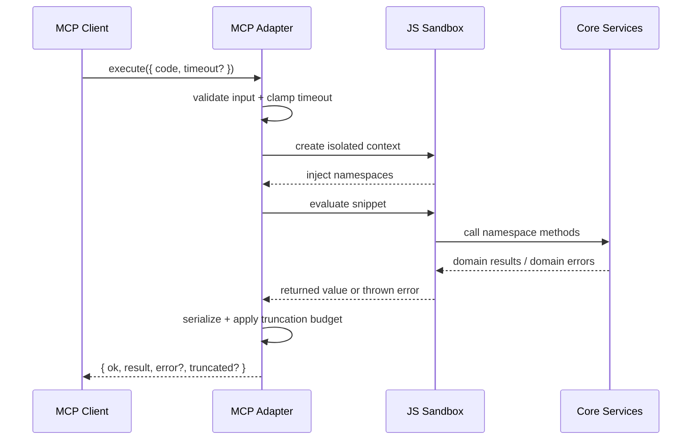
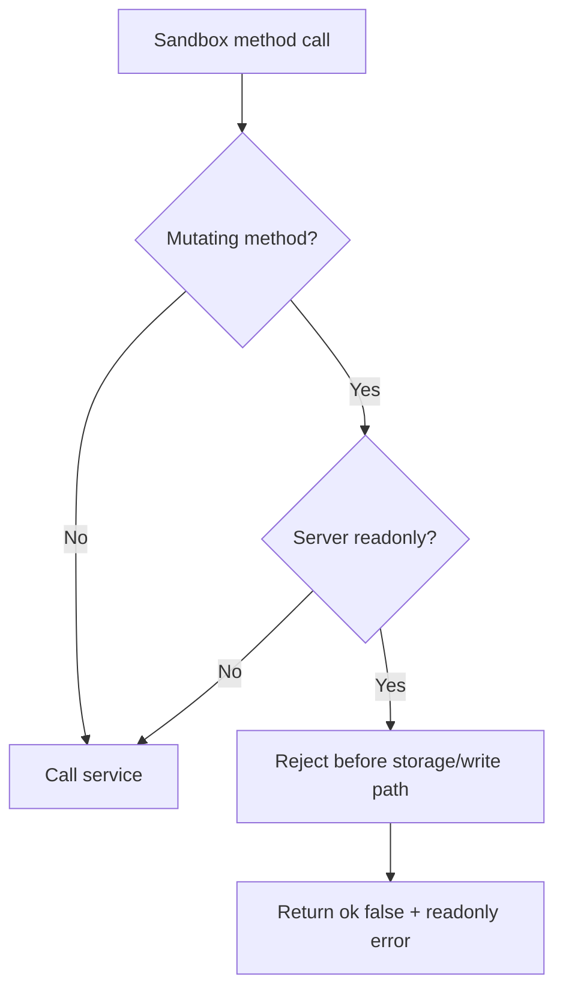

# SPEC-004: MCP Execute API

## Status

Draft

## Purpose

Define the implementation contract for Ringi's MCP surface: one tool, `execute({ code, timeout? })`, which evaluates constrained JavaScript against review-scoped namespaces backed by the same core services used by the UI and CLI. This spec exists so MCP remains a stable adapter over the review domain instead of devolving into transport-first one-off tools.

## Scope

This spec covers:

- the single MCP tool `execute({ code: string, timeout?: number })`
- sandbox construction and isolation rules
- namespace availability and method contracts for `reviews`, `todos`, `sources`, `intelligence`, `events`, and `session`
- readonly enforcement and mutation rejection
- timeout and output truncation behavior
- error reporting from sandbox execution to the MCP client
- security boundaries for the constrained JS runtime
- lifecycle interactions with review state as defined in `docs/specs/review-lifecycle.md`

## Non-Goals

This spec does not cover:

- HTTP endpoint design or CLI human-output formatting
- internal parser implementations for intelligence extraction
- UI rendering of review data
- arbitrary repository exploration outside a review boundary
- adding additional MCP tools beyond `execute`
- a plugin system or user-defined namespace injection

## Canonical References

- `docs/MCP.md`
  - `Overview`
  - `Why Codemode`
  - `Starting the MCP Server`
  - `The Execute Tool`
  - `API Surface`
  - `Data Models`
  - `Error Handling`
  - `Read-Only vs Mutating Operations`
  - `Limitations`
- `docs/ARCHITECTURE.md`
  - §6 `System Overview`
  - §7 `Operational Modes`
  - §8 `Core Runtime Model`
  - §9 `Domain Boundaries`
  - §18 `Agent Integration Strategy`
  - §19 `CLI / Server / Web UI / MCP Relationship`
  - §20 `Security and Local-First Guarantees`
  - §22 `Observability and Diagnostics`
  - §24 `Failure Modes`
- `docs/specs/review-lifecycle.md`
  - DD-1 split lifecycle fields
  - DD-2 immutable self-sufficient review snapshots
  - lifecycle transition rules
- `src/routes/api/-lib/services/review.service.ts`
  - `create`
  - `list`
  - `getById`
  - `getFileHunks`
  - `update`
  - `remove`
  - `getStats`
- `src/api/domain-rpc.ts`
  - `ReviewsRpc`
  - `DomainRpc`
- `src/routes/api/-lib/services/todo.service.ts`
- `src/routes/api/-lib/services/event.service.ts`
- `src/routes/api/-lib/services/git.service.ts`

## Terminology

- **Codemode**: MCP design where the agent sends JavaScript to one tool instead of invoking many transport-level tools.
- **Sandbox**: The constrained JS execution environment used by `execute`.
- **Namespace**: One injected global object inside the sandbox, such as `reviews` or `todos`.
- **Readonly mode**: MCP server mode started via `ringi mcp --readonly`; mutating operations are rejected before they reach storage or write-capable services.
- **Review-scoped intelligence**: Analysis limited to one persisted review snapshot and its immediate blast radius, not repository-wide exploration.
- **Snapshot anchoring**: Review data must come from persisted review snapshot inputs, never regenerated from live git for the same review after creation.
- **Phase unavailable**: A documented namespace or method exists in the product contract but is not yet shipped in the current runtime phase.

## Requirements

### Execute tool contract

- REQ-004-001: Ringi SHALL expose exactly one MCP tool named `execute`.
- REQ-004-002: `execute` input SHALL be `{ code: string; timeout?: number }`.
- REQ-004-003: `code` SHALL be evaluated as JavaScript in a constrained sandbox with `async` / `await` and top-level `await` support.
- REQ-004-004: `execute` output SHALL be `{ ok: boolean; result: unknown; error?: string; truncated?: boolean }` as documented in `docs/MCP.md`.
- REQ-004-005: On successful completion, the adapter SHALL return `ok: true` and the snippet's returned value in `result`.
- REQ-004-006: On rejection or failure, the adapter SHALL return `ok: false`, `result: null`, and a human-readable `error` string.
- REQ-004-007: The MCP transport SHALL remain codemode-first; namespace methods SHALL NOT be re-exposed as separate top-level MCP tools.

### Sandbox environment

- REQ-004-008: Every `execute` call SHALL run in an isolated sandbox with no persistent in-memory state shared across calls.
- REQ-004-009: The only supported injected globals SHALL be `reviews`, `todos`, `sources`, `intelligence`, `events`, and `session`.
- REQ-004-010: The sandbox SHALL expose core-service-backed operations, not raw database handles.
- REQ-004-011: The sandbox SHALL NOT expose filesystem access, network access, process spawning, arbitrary module loading, or unrestricted host globals.
- REQ-004-012: Sandbox code SHALL be unable to mutate adapter configuration, namespace implementations, or other in-flight executions.

### Readonly enforcement

- REQ-004-013: Starting the MCP server with `ringi mcp --readonly` SHALL reject every mutating namespace operation before it reaches storage or other write paths.
- REQ-004-014: Readonly rejection SHALL return `ok: false`, `result: null`, and a human-readable error consistent with `docs/MCP.md` guidance, e.g. `Mutation rejected: MCP server is running in readonly mode`.
- REQ-004-015: Readonly enforcement SHALL be adapter-owned, not delegated to individual domain services.

### Timeouts and truncation

- REQ-004-016: If `timeout` is omitted, the adapter SHALL use `30_000` ms.
- REQ-004-017: If `timeout` exceeds `120_000` ms, the adapter SHALL clamp it to `120_000` ms or reject it; the behavior SHALL be consistent for all calls.
- REQ-004-018: On timeout, the adapter SHALL return `ok: false`, `result: null`, and a human-readable timeout error.
- REQ-004-019: Timeout SHALL be treated as inconclusive; the adapter SHALL NOT synthesize success or failure data for the underlying domain action.
- REQ-004-020: If serialized output exceeds `100KB`, the adapter SHALL truncate the serialized payload and set `truncated: true`.
- REQ-004-021: Truncation SHALL be explicit only; the adapter SHALL NOT silently shorten output without setting `truncated: true`.

### Namespace surface

- REQ-004-022: The `reviews` namespace SHALL implement the method contracts documented in `docs/MCP.md`.
- REQ-004-023: The `todos` namespace SHALL implement the method contracts documented in `docs/MCP.md`, with adapter translation allowed where current service names differ.
- REQ-004-024: The `sources` namespace SHALL provide read-only source discovery and diff preview operations for `staged`, `branch`, and `commits` review sources.
- REQ-004-025: The `intelligence` namespace SHALL remain review-scoped only.
- REQ-004-026: The `events` namespace SHALL expose review event subscription and recent-event retrieval without requiring the sandbox to poll every slice independently.
- REQ-004-027: The `session` namespace SHALL expose repository and adapter context needed for agents to discover active review and readonly state.

### Lifecycle integration

- REQ-004-028: MCP review mutations SHALL obey the review lifecycle rules in `docs/specs/review-lifecycle.md`.
- REQ-004-029: Any MCP-backed review read that depends on diff hunks SHALL honor snapshot anchoring and SHALL NOT regenerate branch or commit hunks from live git for anchored reviews created after lifecycle cutover.
- REQ-004-030: MCP SHALL surface the same review truth humans inspect; it SHALL NOT use a shadow review representation separate from the core service layer.

### Errors, concurrency, and security

- REQ-004-031: Invalid JavaScript, missing namespace methods, and thrown exceptions inside the snippet SHALL be reported as `ok: false` sandbox failures.
- REQ-004-032: Multiple concurrent `execute` calls from the same MCP client SHALL be isolated from each other.
- REQ-004-033: Concurrent read-only executions MAY proceed in parallel.
- REQ-004-034: Concurrent mutating executions SHALL rely on the same single-process, SQLite-WAL-backed write coordination used by the rest of the application.
- REQ-004-035: Sandbox escape attempts SHALL fail closed, emit diagnostics, and SHALL NOT expose host capabilities or raw services.

## Workflow / State Model

### 1. Execute call pipeline



### 2. Readonly decision path



### 3. Lifecycle interaction

- `reviews.create(...)` enters the review-creation path owned by `ReviewService.create()` and therefore participates in `created -> analyzing -> ready` behavior defined by `docs/specs/review-lifecycle.md`.
- Reads such as `reviews.get(...)`, `reviews.getFiles(...)`, and `reviews.getDiff(...)` consume the persisted review snapshot and MUST preserve snapshot anchoring.
- Mutations that add operational work, such as todo creation for a review, participate in lifecycle reopening rules once lifecycle cutover is implemented.

## API / CLI / MCP Implications

### MCP tool contract

```ts
export type ExecuteInput = {
  code: string;
  timeout?: number;
};

export type ExecuteOutput = {
  ok: boolean;
  result: unknown;
  error?: string;
  truncated?: boolean;
};
```

### Namespace contracts

#### `reviews`

```ts
type ReviewStatus = "in_progress" | "approved" | "changes_requested";
type ReviewSourceType = "staged" | "branch" | "commits";
type ReviewId = string;
type SnapshotId = string;
type FilePath = string;
type CommentStatus = "open" | "resolved";

type ReviewListFilter = {
  status?: ReviewStatus[];
  sourceType?: ReviewSourceType[];
  limit?: number;
};

type ReviewCreateInput = {
  title?: string;
  source: {
    type: ReviewSourceType;
    baseRef?: string | null;
    headRef?: string | null;
    commits?: string[];
  };
  provenance?: Provenance[];
  groupHints?: string[];
};

type ReviewDiffQuery = {
  reviewId: ReviewId;
  filePath: FilePath;
  contextLines?: number;
};

type ReviewExportOptions = {
  reviewId: ReviewId;
  includeResolved?: boolean;
  includeSuggestions?: boolean;
};

interface ReviewsNamespace {
  list(filter?: ReviewListFilter): Promise<Review[]>;
  get(reviewId: ReviewId): Promise<Review>;
  create(input: ReviewCreateInput): Promise<Review>;
  getFiles(reviewId: ReviewId): Promise<ReviewFile[]>;
  getDiff(query: ReviewDiffQuery): Promise<ReviewFile>;
  getComments(reviewId: ReviewId, filePath?: FilePath): Promise<Comment[]>;
  getSuggestions(reviewId: ReviewId): Promise<Suggestion[]>;
  getStatus(reviewId: ReviewId): Promise<{
    reviewId: ReviewId;
    status: ReviewStatus;
    totalComments: number;
    unresolvedComments: number;
    resolvedComments: number;
    withSuggestions: number;
  }>;
  export(options: ReviewExportOptions): Promise<{
    reviewId: ReviewId;
    markdown: string;
  }>;
}
```

Implementation notes:

- Current `src/api/domain-rpc.ts` exposes only `reviews_list`, `reviews_getById`, `reviews_create`, `reviews_update`, `reviews_remove`, and `reviews_stats`.
- Current `src/routes/api/-lib/services/review.service.ts` implements `create`, `list`, `getById`, `getFileHunks`, `update`, `remove`, and `getStats`.
- Adapter-owned method mapping is therefore required for the documented MCP names (`get`, `getFiles`, `getDiff`, `getStatus`, `export`, `getComments`, `getSuggestions`) until the transport and service contracts converge.

#### `todos`

```ts
type TodoId = string;
type TodoStatus = "open" | "done";

type TodoListFilter = {
  reviewId?: ReviewId | null;
  status?: TodoStatus;
};

type TodoCreateInput = {
  text: string;
  reviewId?: ReviewId | null;
};

interface TodosNamespace {
  list(filter?: TodoListFilter): Promise<Todo[]>;
  add(input: TodoCreateInput): Promise<Todo>;
  done(todoId: TodoId): Promise<Todo>;
  undone(todoId: TodoId): Promise<Todo>;
  move(todoId: TodoId, position: number): Promise<Todo[]>;
  remove(todoId: TodoId): Promise<{ success: true }>;
  clear(
    reviewId?: ReviewId | null
  ): Promise<{ success: true; removed: number }>;
}
```

Implementation notes:

- Current `TodoService` uses `create`, `list`, `update`, `toggle`, `remove`, `removeCompleted`, `reorder`, and `move`.
- The MCP adapter MUST translate the public MCP verbs (`add`, `done`, `undone`, `clear`) onto the existing service surface or align the service surface in the same cutover.
- Because current `TodoService.move()` returns a single `Todo`, but `docs/MCP.md` specifies `Promise<Todo[]>`, this contract mismatch MUST be resolved before shipping the namespace.

#### `sources`

```ts
type SourcePreview = {
  source: ReviewSource;
  summary: {
    totalFiles: number;
    totalAdditions: number;
    totalDeletions: number;
  };
  files: Array<{
    path: string;
    status: ReviewFileStatus;
    additions: number;
    deletions: number;
  }>;
};

type ReviewSource =
  | { type: "staged" }
  | { type: "branch"; baseRef: string; headRef: string }
  | { type: "commits"; commits: string[] };

interface SourcesNamespace {
  list(): Promise<{
    staged: { available: boolean };
    branches: Array<{ name: string; current: boolean }>;
    recentCommits: Array<{
      hash: string;
      author: string;
      date: string;
      message: string;
    }>;
  }>;
  previewDiff(source: ReviewSource): Promise<SourcePreview>;
}
```

Implementation notes:

- Current source discovery lives in `GitService` (`getStagedDiff`, `getBranchDiff`, `getCommitDiff`, branch/commit listing helpers) rather than in a dedicated `SourceService`.
- The adapter SHALL isolate git access behind a source-oriented boundary even if the first implementation delegates to `GitService`.

#### `intelligence`

```ts
type RelationshipKind =
  | "imports"
  | "calls"
  | "re_exports"
  | "renames"
  | "configuration"
  | "test_coverage";

type ValidateOptions = {
  reviewId: ReviewId;
  checks?: Array<
    | "changed_exports"
    | "unresolved_comments"
    | "impact_coverage"
    | "confidence_gaps"
  >;
};

interface IntelligenceNamespace {
  getRelationships(reviewId: ReviewId): Promise<Relationship[]>;
  getImpacts(reviewId: ReviewId): Promise<
    Array<{
      fileId: string;
      path: string;
      impactedBy: string[];
      uncoveredDependents: string[];
      confidence: number;
    }>
  >;
  getConfidence(reviewId: ReviewId): Promise<ConfidenceScore[]>;
  validate(options: ValidateOptions): Promise<{
    reviewId: ReviewId;
    ok: boolean;
    checks: Array<{
      kind: string;
      ok: boolean;
      message: string;
      relatedFiles?: string[];
    }>;
  }>;
}
```

Implementation notes:

- `docs/MCP.md` defines this namespace as Phase 2+ and review-scoped only.
- Current `src/` scan shows no shipped intelligence service or RPC contract for these methods; until implemented, calls MUST fail as phase unavailable instead of pretending the capability exists.

#### `events`

```ts
type ReviewEventType =
  | "reviews.updated"
  | "comments.updated"
  | "todos.updated"
  | "files.changed";

type EventSubscription = {
  id: string;
  eventTypes: ReviewEventType[];
  reviewId?: ReviewId;
};

interface EventsNamespace {
  subscribe(filter?: {
    eventTypes?: ReviewEventType[];
    reviewId?: ReviewId;
  }): Promise<EventSubscription>;
  listRecent(filter?: {
    reviewId?: ReviewId;
    limit?: number;
  }): Promise<ReviewEvent[]>;
}
```

Implementation notes:

- Current `EventService` provides `subscribe()`, `broadcast()`, `startFileWatcher(repoPath)`, and `getClientCount()`.
- Current `EventService` does not expose a recent-event buffer API; `listRecent()` therefore requires adapter-owned buffering or service expansion.
- `EventService.startFileWatcher()` exists in source, and architecture requires watcher wiring at runtime, but the project background notes it is not currently invoked.

#### `session`

```ts
interface SessionNamespace {
  context(): Promise<{
    repository: {
      name: string;
      path: string;
      branch: string;
      remote?: string | null;
    };
    readonly: boolean;
    serverMode: "stdio";
    activeReviewId?: ReviewId | null;
    activeSnapshotId?: SnapshotId | null;
  }>;
  status(): Promise<{
    ok: true;
    readonly: boolean;
    activeSubscriptions: number;
    currentPhase: "phase1" | "phase2" | "phase3";
  }>;
}
```

Implementation notes:

- `session.context()` is the required discovery step when the agent does not already know repository, active review, or readonly state.
- `session.status()` is the required health/phase gate for capability checks.

### Surface implications

- CLI surface remains `ringi mcp [--readonly]`; CLI does not gain one subcommand per namespace method.
- HTTP and RPC are implementation details for MCP. The MCP client contract is the execute tool plus injected namespaces, not `reviews_*` RPC names.
- Because `DomainRpc` currently covers only reviews, MCP adapter implementation cannot be assumed to be a thin RPC mirror.

## Data Model Impact

- No execute-specific tables are required by this spec.
- Readonly mode, timeout state, and active subscription counts are runtime concerns and SHOULD remain adapter/process state, not persisted schema.
- This spec depends on existing review, review file, comment, suggestion, todo, provenance, relationship, confidence, and event-domain data defined elsewhere.
- Lifecycle alignment depends on the schema changes specified in `docs/specs/review-lifecycle.md`, especially split lifecycle fields and immutable snapshot anchoring.
- `events.listRecent()` may require an in-memory ring buffer or persisted event cursor table if recent-event replay becomes a hard requirement. This spec does not require persistence for that buffer.

## Service Boundaries

- **MCP adapter owns**: input validation, timeout enforcement, sandbox creation, namespace injection, readonly gating, output serialization, truncation, and sandbox error translation.
- **ReviewService owns**: review creation, review lookup, file metadata, anchored hunk access, and review status/statistics.
- **TodoService owns**: todo creation, listing, completion state changes, ordering, removal, and stats.
- **EventService owns**: event subscription primitives, event broadcasting, watcher startup, and subscriber counts.
- **GitService owns**: repository metadata and diff/source acquisition behind adapters; MCP code MUST NOT call git directly.
- **ExportService / CommentService / intelligence services own**: export rendering, comment/suggestion reads, and review-scoped analysis once those adapters are wired.
- Core services SHALL remain the only domain owners. The sandbox SHALL NOT talk to SQLite or git directly.

## Security Model

- The sandbox SHALL run in a constrained JS environment with an explicit namespace allowlist only.
- Disallowed capabilities SHALL include:
  - filesystem reads or writes
  - network sockets or HTTP requests
  - process spawning or shell execution
  - arbitrary module imports / `require()` / dynamic loading
  - raw access to the host `process`, unrestricted `globalThis`, or adapter internals
- Returned strings and structured values from the sandbox SHALL be treated as untrusted data.
- Failed escape attempts SHALL not downgrade into partial capability exposure; the adapter MUST fail closed.
- Review-scoped intelligence is a product and security boundary. The sandbox SHALL NOT expose generic repository exploration APIs outside the review/workflow surface.

## Edge Cases

- **Timeout exceeded**: return `ok: false` with timeout error; do not imply that validations passed or failed.
- **Invalid JavaScript in `code`**: reject as sandbox failure before domain calls run.
- **Snippet throws**: adapter returns `ok: false`; do not leak raw internal stack traces into the MCP contract.
- **Snippet returns an error-shaped object instead of throwing**: adapter treats it as a successful returned value if the snippet completed normally; only transport/sandbox failures set `ok: false`.
- **Namespace method does not exist**: sandbox failure with a human-readable error.
- **Readonly mutation attempt**: reject before storage/write path.
- **Very large return value**: truncate serialized output at `100KB`, set `truncated: true`.
- **Concurrent execute calls from one client**: isolate sandbox memory and subscriptions per call; shared domain writes still serialize through the normal runtime.
- **Phase-unavailable namespace**: fail explicitly rather than returning empty success shapes.
- **Legacy branch/commit reviews without persisted hunks**: lifecycle spec calls these degraded; MCP MUST NOT silently treat regenerated live git hunks as canonical after cutover.

## Observability

- MCP adapter startup SHALL be logged as a structured event.
- Each `execute` call SHOULD log: request id, readonly flag, timeout budget, completion/failure status, elapsed time, truncation flag, and failure class.
- Readonly rejections, sandbox failures, timeouts, and escape attempts SHALL produce diagnostics without leaking raw host internals into the agent-facing contract.
- Namespace availability and phase-unavailable rejections SHALL be locally diagnosable, consistent with `docs/ARCHITECTURE.md` §22.
- Event subscription counts SHOULD be observable through adapter diagnostics and/or `session.status()`.

## Rollout Considerations

- Ship as codemode-only from the beginning; do not add a temporary tool-per-operation compatibility layer.
- Read-heavy namespaces (`reviews`, `sources`, `session`, read-only `todos`) land first, matching `docs/ARCHITECTURE.md` §18 adoption order.
- Mutations remain gated by readonly enforcement and current phase availability.
- Intelligence methods SHOULD return phase-unavailable until backed by real review-scoped intelligence artifacts.
- Lifecycle cutover from legacy `Review.status` to split lifecycle fields MUST happen as a full contract cutover, not as dual truth.
- Snapshot anchoring defects in current `ReviewService.getFileHunks()` for branch and commits reviews MUST be fixed before MCP diff reads can claim immutable review truth.

## Open Questions

- **AMBIGUITY:** `docs/ARCHITECTURE.md` §18 names namespaces including `exports`, while `docs/MCP.md` defines `session` and puts export under `reviews.export(...)` instead of a separate `exports` namespace. Proposed resolution: treat `docs/MCP.md` as the external MCP contract and update architecture wording to match it.
- **AMBIGUITY:** `docs/MCP.md` still uses legacy `Review.status = in_progress | approved | changes_requested`, but `docs/specs/review-lifecycle.md` replaces that with split lifecycle fields and a derived lifecycle state. Proposed resolution: when lifecycle cutover lands, MCP SHALL expose the derived lifecycle state in the same cutover and remove the parallel legacy truth.
- **AMBIGUITY:** `src/api/domain-rpc.ts` exposes only reviews RPC methods, while `docs/MCP.md` documents six namespaces. Proposed resolution: MCP adapter may call services directly, but the shipped runtime MUST make missing namespaces fail explicitly as phase unavailable until implemented.
- **AMBIGUITY:** `docs/MCP.md` specifies `events.listRecent(...)`, but current `EventService` has no recent-event buffer. Proposed resolution: either add a bounded in-memory recent-event buffer or narrow the public contract before release.
- **AMBIGUITY:** `docs/MCP.md` specifies `todos.move(...): Promise<Todo[]>`, while current `TodoService.move()` returns one `Todo`. Proposed resolution: pick one representation and cut over everywhere; do not ship both.
- **AMBIGUITY:** Current project background says `EventService.startFileWatcher` exists but is never invoked. Proposed resolution: runtime boot for `ringi mcp` must state whether file events are supported live, replay-only, or unavailable.

## Acceptance Criteria

- `docs/specs/mcp-execute-api.md` exists and is versioned as `SPEC-004`.
- The spec contains all mandatory sections plus a dedicated `Security Model` section.
- The spec defines the single-tool MCP contract `execute({ code, timeout? })` and forbids parallel top-level MCP tools.
- The spec documents all six namespaces (`reviews`, `todos`, `sources`, `intelligence`, `events`, `session`) with method signatures.
- The spec marks mutating vs read-only behavior and defines adapter-enforced readonly rejection.
- The spec defines default timeout, maximum timeout, timeout failure behavior, output budget, and truncation flag semantics.
- The spec defines sandbox failure, invalid-JS, missing-method, and escape-attempt handling.
- The spec explicitly ties review reads and mutations to `docs/specs/review-lifecycle.md`, including snapshot anchoring and lifecycle cutover implications.
- The spec calls out current contract mismatches and implementation gaps using `**AMBIGUITY:**` markers instead of hiding them.
